# AegisWhistle Technical Documentation - Part 1

## Table of Contents
1. [Executive Summary](#executive-summary)
2. [System Architecture](#system-architecture)
3. [User Roles and Access Control](#user-roles-and-access-control)
4. [Hyperledger Fabric Integration](#hyperledger-fabric-integration)

## Executive Summary

AegisWhistle is a comprehensive SaaS-based whistleblower platform that combines voice-driven reporting, blockchain security, and multi-tenant organization management. The platform leverages Hyperledger Fabric for secure, immutable record-keeping and provides anonymous reporting capabilities with crypto-based reward systems.

Key features include:
- Separate Hyperledger Fabric networks for each organization
- Voice-powered reporting using VAPI and Gemini Live AI
- Multi-tenant architecture with organization isolation
- Professional marketplace for legal and healthcare services
- Crypto reward system with both built-in and external wallet support
- Configurable whistleblower anonymity options

## System Architecture

### High-Level Architecture Overview

```
┌─────────────────────────────────────────────────────────────────────────────────────┐
│                                                                                     │
│                     AEGISWHISTLE SAAS PLATFORM                                      │
│                                                                                     │
├─────────────────────────────────────────────────────────────────────────────────────┤
│  ┌───────────────────────────────────────────────────────────────────────────────┐  │
│  │                           FRONTEND LAYER                                      │  │
│  │  ┌─────────────────────┐  ┌─────────────────────┐  ┌─────────────────────┐  │  │
│  │  │  Public Landing     │  │  Organization       │  │  Admin Dashboard    │  │  │
│  │  │  • Marketing Site   │  │  Portals            │  │  • System Health    │  │  │
│  │  │  • Documentation    │  │  • {org}.aegiswhistle│  │  • User Management  │  │  │
│  │  │  • Signup Flows     │  │  • Custom Branding   │  │  • Analytics        │  │  │
│  │  └─────────────────────┘  └─────────────────────┘  └─────────────────────┘  │  │
│  │                                                                               │  │
│  │  ┌─────────────────────────────────────────────────────────────────────┐      │  │
│  │  │                  Professional Marketplace                          │      │  │  
│  │  │  • Service Provider Directory  • Booking System  • Reviews & Ratings  │      │  │
│  │  └─────────────────────────────────────────────────────────────────────┘      │  │
│  └───────────────────────────────────────────────────────────────────────────────┘  │
├─────────────────────────────────────────────────────────────────────────────────────┤
│  ┌───────────────────────────────────────────────────────────────────────────────┐  │
│  │                    API GATEWAY & SECURITY LAYER                             │  │
│  │  ┌───────────────┐  ┌────────────────┐  ┌─────────────────┐  ┌───────────┐  │  │
│  │  │ Authentication│  │ Rate Limiting  │  │ Request         │  │ API       │  │  │
│  │  │ • JWT         │  │ • DDoS         │  │ Validation      │  │ Versioning│  │  │
│  │  │ • OAuth 2.0   │  │ Protection     │  │ • Schema        │  │ • v1, v2  │  │  │
│  │  │ • MFA         │  │ • Throttling   │  │   Validation   │  │ • Deprecation│  │  │
│  │  └───────────────┘  └────────────────┘  └─────────────────┘  └───────────┘  │  │
│  │  ┌─────────────────────────────────────────────────────────────────────┐      │  │
│  │  │                      Multi-tenant Request Router                    │      │  │
│  │  │  • Tenant Identification  • Request Context  • Data Isolation       │      │  │
│  │  └─────────────────────────────────────────────────────────────────────┘      │  │
│  └───────────────────────────────────────────────────────────────────────────────┘  │
├─────────────────────────────────────────────────────────────────────────────────────┤
│  ┌───────────────────────────────────────────────────────────────────────────────┐  │
│  │                       CORE BACKEND SERVICES                                 │  │
│  │  ┌─────────────────────┐  ┌─────────────────────┐  ┌─────────────────────┐  │  │
│  │  │ Organization        │  │ User Management     │  │ Voice Processing    │  │  │
│  │  │ • Tenant Onboarding │  │ • RBAC             │  │ • VAPI Integration  │  │  │
│  │  │ • Configuration     │  │ • Profile Management│  │ • Gemini AI        │  │  │
│  │  • Billing          │  • Audit Logs       │  • Transcription    │  │  │
│  │  └─────────────────────┘  └─────────────────────┘  └─────────────────────┘  │  │
│  │  ┌─────────────────────┐  ┌─────────────────────┐  ┌─────────────────────┐  │  │
│  │  │ Blockchain Service  │  │ Notification        │  │ Payment Service     │  │  │
│  │  │ • Smart Contracts   │  │ • Email/SMS         │  │ • Crypto Rewards    │  │  │
│  │  │ • Chaincode         │  │ • Real-time Alerts  │  │ • Fiat Processing   │  │  │
│  │  • Immutable Ledger  │  • Webhooks         │  • Wallet Management │  │  │
│  │  └─────────────────────┘  └─────────────────────┘  └─────────────────────┘  │  │
│  │  ┌─────────────────────────────────────────────────────────────────────┐      │  │
│  │  │                     Marketplace Service                            │      │  │
│  │  │  • Service Provider Onboarding  • Billing  • Dispute Resolution    │      │  │
│  │  └─────────────────────────────────────────────────────────────────────┘      │  │
│  └───────────────────────────────────────────────────────────────────────────────┘  │
├─────────────────────────────────────────────────────────────────────────────────────┤
│  ┌───────────────────────────────────────────────────────────────────────────────┐  │
│  │                           DATA LAYER                                        │  │
│  │  ┌─────────────────────┐  ┌─────────────────────┐  ┌─────────────────────┐  │  │
│  │  │ PostgreSQL         │  │ Redis               │  │ Object Storage      │  │  │
│  │  │ • User Data        │  • Caching           │  • Evidence Files    │  │  │
│  │  │ • Application State│  • Rate Limiting    │  • Document Storage  │  │  │
│  │  • Multi-tenant     │  • Real-time Events  │  • Media Assets      │  │  │
│  │  └─────────────────────┘  └─────────────────────┘  └─────────────────────┘  │  │
│  └───────────────────────────────────────────────────────────────────────────────┘  │
├─────────────────────────────────────────────────────────────────────────────────────┤
│  ┌───────────────────────────────────────────────────────────────────────────────┐  │
│  │                       BLOCKCHAIN LAYER                                      │  │
│  │  ┌─────────────────────────────────────────────────────────────────────┐      │  │
│  │  │                  Per-Organization Networks                          │      │  │
│  │  │  ┌───────────────┐  ┌────────────────┐  ┌─────────────────┐  │      │  │
│  │  │  │ Org A         │  │ Org B          │  │ Org N           │  │      │  │
│  │  │  │ • Peers       │  • Peers        │  • Peers         │  │      │  │
│  │  │  │ • Orderers    │  • Orderers     │  • Orderers      │  │      │  │
│  │  │  │ • CA          │  • CA           │  • CA            │  │      │  │
│  │  │  └───────────────┘  └────────────────┘  └─────────────────┘  │      │  │
│  │  └─────────────────────────────────────────────────────────────────────┘      │  │
│  │  ┌─────────────────────────────────────────────────────────────────────┐      │  │
│  │  │                  Cross-Network Bridge (Optional)                   │      │  │
│  │  │  • Secure Data Sharing  • Selective Disclosure  • Audit Trail      │      │  │
│  │  └─────────────────────────────────────────────────────────────────────┘      │  │
│  └───────────────────────────────────────────────────────────────────────────────┘  │
├─────────────────────────────────────────────────────────────────────────────────────┤
│  ┌───────────────────────────────────────────────────────────────────────────────┐  │
│  │                       EXTERNAL INTEGRATIONS                                │  │
│  │  ┌───────────────┐  ┌────────────────┐  ┌─────────────────┐  ┌───────────┐  │  │
│  │  │ AI/ML         │  │ Payment        │  │ Identity        │  │ Email/SMS │  │  │
│  │  │ • VAPI        │  • Crypto Wallets│  • Verification  │  • SendGrid │  │  │
│  │  │ • Gemini Live │  • Stripe        │  • KYC/AML       │  • Twilio   │  │  │
│  │  │ • NLP Models  │  • Plaid         │  • OAuth         │  • AWS SES  │  │  │
│  │  └───────────────┘  └────────────────┘  └─────────────────┘  └───────────┘  │  │
│  └───────────────────────────────────────────────────────────────────────────────┘  │
└─────────────────────────────────────────────────────────────────────────────────────┘
```

### Detailed Architecture Diagram

```mermaid
graph TD
    %% Main Components
    subgraph "AegisWhistle Platform"
        FE[Frontend Layer]
        API[API Gateway]
        AUTH[Authentication Service]
        ORG[Organization Service]
        VOICE[Voice Processing Service]
        BLOCK[Blockchain Service]
        NOTIF[Notification Service]
        PAY[Payment Service]
        MRKT[Marketplace Service]
        
        %% Data Stores
        subgraph "Data Layer"
            PG[(PostgreSQL)]
            REDIS[(Redis)]
            S3[(S3 Storage)]
        end
        
        %% Blockchain Networks
        subgraph "Blockchain Layer"
            HL1[Organization 1\nHyperledger Network]
            HL2[Organization 2\nHyperledger Network]
            HL3[Organization N\nHyperledger Network]
        end
    end
    
    %% External Services
    VAPI[VAPI Voice AI]
    GEMINI[Gemini Live AI]
    WALLET[Crypto Wallets]
    PAYPROC[Payment Processors]
    IDV[Identity Verification]
    
    %% User Interactions
    WB[Whistleblower] -->|1. Submit Report| FE
    EO[Ethics Officer] -->|2. Review Case| FE
    INV[Investigator] -->|3. Investigate| FE
    
    %% Internal Connections
    FE -->|API Calls| API
    API --> AUTH
    API --> ORG
    API --> VOICE
    API --> BLOCK
    API --> NOTIF
    API --> PAY
    API --> MRKT
    
    %% Service to Data Store Connections
    AUTH --> PG
    ORG --> PG
    VOICE --> S3
    BLOCK --> HL1 & HL2 & HL3
    
    %% External Integrations
    VOICE --> VAPI & GEMINI
    PAY --> WALLET & PAYPROC
    AUTH --> IDV
    
    %% Styling
    classDef platform fill:#f9f9f9,stroke:#333,stroke-width:2px
    classDef data fill:#e6f3ff,stroke:#1a73e8
    classDef blockchain fill:#e8f5e9,stroke:#2e7d32
    classDef external fill:#fff3e0,stroke:#f57c00
    
    class AegisWhistle platform
    class PG,REDIS,S3 data
    class HL1,HL2,HL3 blockchain
    class VAPI,GEMINI,WALLET,PAYPROC,IDV,WB,EO,INV external
```



### Component Descriptions

#### 1. Frontend Layer (React/Next.js)
- **Public Landing Pages**: Marketing site, documentation, and signup flows
- **Organization Portals**: Tenant-specific interfaces at `{org}.aegiswhistle.com`
- **Admin Dashboard**: System administration and monitoring
- **Professional Marketplace**: Directory of vetted service providers

#### 2. API Gateway & Core Services
- **Authentication Service**: JWT-based auth, session management
- **Organization Service**: Multi-tenant management and configuration
- **Voice Processing Service**: Handles voice report transcription and analysis
- **Blockchain Service**: Manages interactions with Hyperledger networks
- **Notification Service**: Real-time alerts and communications
- **Payment Service**: Crypto rewards and payment processing
- **Marketplace Service**: Professional services directory and booking

#### 3. Data Layer
- **PostgreSQL**: Primary operational database with tenant isolation
- **Redis**: Caching, rate limiting, and real-time features
- **S3 Storage**: Secure file storage for evidence and documents

#### 4. Blockchain Layer
- **Dedicated Hyperledger Networks**: One per organization
- **Smart Contracts**: Custom chaincode for complaint management
- **Private Data Collections**: For sensitive information

### Data Flow

1. **Whistleblower Submission Flow**:
   - User submits report via web/mobile interface
   - Voice reports processed by VAPI/Gemini AI
   - Report hashed and stored on blockchain
   - Confirmation and tracking ID provided

2. **Case Management Flow**:
   - Ethics Officer reviews and assigns cases
   - Investigators access case details
   - Evidence collected and linked to blockchain
   - Resolution and reward processing

3. **Blockchain Operations**:
   - All critical operations recorded on-chain
   - Immutable audit trail maintained
   - Cross-organization verification when needed

### Security Architecture

- **Network Security**:
  - VPC isolation for each environment
  - Web Application Firewall (WAF) protection
  - DDoS mitigation
  
- **Data Protection**:
  - Encryption at rest and in transit
  - Hardware Security Modules (HSM) for key management
  - Regular security audits and penetration testing
  
- **Compliance**:
  - GDPR/CCPA ready
  - SOC 2 Type II compliance
  - Regular third-party security assessments
│ API Gateway & Authentication Layer                              │
│ ├── JWT Authentication                                          │
│ ├── Role-Based Access Control (RBAC)                            │
│ ├── Rate Limiting & Security                                    │
│ └── Multi-tenant Routing                                        │
├─────────────────────────────────────────────────────────────────┤
│ Backend Services (Node.js/Express)                              │
│ ├── Organization Management Service                             │
│ ├── User Management Service                                     │
│ ├── Voice Processing Service (VAPI + Gemini Live)               │
│ ├── Blockchain Integration Service                              │
│ ├── Notification Service                                        │
│ ├── Crypto Wallet Service                                       │
│ └── Professional Marketplace Service                            │
├─────────────────────────────────────────────────────────────────┤
│ Data Layer                                                      │
│ ├── PostgreSQL (User data, sessions, cache)                     │
│ ├── Redis (Session storage, real-time data)                     │
│ └── File Storage (AWS S3/CloudFlare R2)                         │
├─────────────────────────────────────────────────────────────────┤
│ Blockchain Layer (Per Organization)                             │
│ ├── Hyperledger Fabric Network 1 (Org A)                        │
│ ├── Hyperledger Fabric Network 2 (Org B)                        │
│ ├── Cross-Network Bridge (Optional)                             │
│ └── Certificate Authority per Network                           │
├─────────────────────────────────────────────────────────────────┤
│ External Integrations                                           │
│ ├── VAPI (Voice AI)                                             │
│ ├── Google Gemini Live AI                                       │
│ ├── Crypto Wallets (MetaMask, WalletConnect)                    │
│ ├── Payment Processors (Plaid, Stripe)                          │
│ └── Email Services (SendGrid, AWS SES)                          │
└─────────────────────────────────────────────────────────────────┘
```

### Multi-Tenant Architecture

AegisWhistle's multi-tenant architecture is a sophisticated design that enables multiple organizations to use the same application instance while maintaining complete data isolation and security. This approach provides a balance between resource efficiency and strict data separation, which is crucial for a whistleblower platform handling sensitive information.

#### Core Components

1. **Organization Isolation**
   - Each organization operates in its own isolated environment
   - Complete logical separation of data and configurations
   - Independent security policies and access controls

2. **Subdomain Routing**
   - Unique subdomains for each organization (e.g., `acme.aegiswhistle.com`)
   - Automatic routing to the correct organization's environment
   - Custom branding and theming per subdomain

3. **Dedicated Blockchain Networks**
   - Separate Hyperledger Fabric network for each organization
   - Isolated blockchain ledgers for immutable record-keeping
   - Independent smart contracts and chaincode execution

4. **Data Partitioning**
   - Tenant-based data isolation in PostgreSQL
   - Row-level security policies to enforce data separation
   - Encrypted data storage with organization-specific keys

5. **Cross-Organization Communication**
   - Optional secure bridge for inter-organization data sharing
   - Controlled and audited data exchange mechanisms
   - Configurable data sharing policies

#### Technical Implementation

- **Authentication & Authorization**:
  - JWT-based authentication with tenant context
  - Role-based access control (RBAC) with organization-specific roles
  - Session management with tenant isolation

- **Data Access Layer**:
  - Database schema with tenant_id partitioning
  - Middleware for automatic tenant context injection
  - Query filters to prevent data leakage between tenants

- **Infrastructure**:
  - Containerized services with Kubernetes namespaces per tenant
  - Network policies to isolate tenant traffic
  - Resource quotas and limits per organization

#### Security Considerations

- **Data Isolation**:
  - Strict separation of sensitive data between organizations
  - No shared database tables containing mixed-tenant data
  - Separate encryption keys per organization

- **Compliance**:
  - Supports organization-specific compliance requirements
  - Audit trails for all cross-tenant operations
  - Data residency options for regulated industries

- **Performance**:
  - Resource allocation policies to prevent "noisy neighbor" issues
  - Caching strategies with tenant-aware invalidation
  - Scalable architecture to handle varying organization sizes

This architecture ensures that while organizations share the same application codebase and infrastructure, their data and operations remain completely isolated, providing the security and privacy required for handling sensitive whistleblower reports.

#### Dual Database Strategy: PostgreSQL and Hyperledger Fabric

AegisWhistle employs a sophisticated dual database architecture that leverages both PostgreSQL and Hyperledger Fabric, each serving distinct yet complementary roles in the platform:

##### Data Distribution Between PostgreSQL and Hyperledger Fabric

**PostgreSQL Data (Operational & User Management):**

1. **User and Authentication Data**: 
   - User profiles, credentials, and role assignments
   - Session management and JWT token handling
   - Organization administrator accounts and permissions
   - Professional marketplace provider profiles and verification data

2. **Application State and Performance Data**: 
   - Real-time application state that requires high-performance read/write operations
   - Caching layer for frequently accessed blockchain data
   - Queue management for asynchronous operations
   - Temporary storage for in-progress voice transcriptions

3. **Configuration and Preferences**: 
   - Organization-specific settings (anonymity levels, reward policies, etc.)
   - UI customization preferences (themes, logos, colors)
   - Integration configurations (API keys, webhook URLs, etc.)
   - Feature toggles and platform settings

4. **Analytics and Reporting Metadata**: 
   - Aggregated statistics (without sensitive details)
   - Report templates and saved queries
   - Dashboard configurations and user preferences
   - Usage metrics and system performance data

**Hyperledger Fabric Data (Immutable Records):**

1. **Whistleblower Reports**: 
   - Complete complaint details with immutable timestamps
   - Evidence hashes and metadata (actual files stored encrypted in IPFS)
   - Whistleblower identity information (encrypted or anonymized based on settings)
   - Case status and investigation progress

2. **Investigation Records**: 
   - All actions taken during investigations
   - Communication logs between investigators and whistleblowers
   - Evidence chain of custody
   - Investigation findings and conclusions

3. **Reward Transactions**: 
   - Reward approvals and amounts
   - Cryptocurrency wallet transactions
   - Claim records and verification proofs
   - Payment confirmations and receipts

4. **Complete Audit Trail**: 
   - Every system action with immutable timestamps
   - Access logs for sensitive information
   - Compliance-related activities
   - Regulatory reporting evidence

##### Integration Architecture

The integration between PostgreSQL and Hyperledger Fabric is implemented through a sophisticated middleware layer that ensures data consistency, security, and performance:

```
┌─────────────────────────────────────────────────────────────┐
│                      API Gateway Layer                       │
└───────────────────────────┬─────────────────────────────────┘
                            ▼
┌─────────────────────────────────────────────────────────────┐
│                   Database Orchestrator                      │
├─────────────────────────────────────────────────────────────┤
│  ┌─────────────────┐            ┌──────────────────────┐    │
│  │ Data Router     │◄───────────┤ Transaction Manager  │    │
│  └────────┬────────┘            └──────────────────────┘    │
│           │                                                  │
│  ┌────────▼────────┐            ┌──────────────────────┐    │
│  │ Schema Mapper   │◄───────────┤ Sync Service         │    │
│  └────────┬────────┘            └──────────────────────┘    │
│           │                                                  │
│  ┌────────▼────────┐            ┌──────────────────────┐    │
│  │ Query Builder   │◄───────────┤ Cache Manager        │    │
│  └────────┬────────┘            └──────────────────────┘    │
└───────────┼──────────────────────────────────────────────────┘
            │
┌───────────▼──────────┐      ┌───────────────────────────────┐
│                      │      │                                 │
│     PostgreSQL       │◄─────┤      Hyperledger Fabric        │
│                      │      │                                 │
└──────────────────────┘      └───────────────────────────────┘
```

##### Key Integration Components:

1. **Data Router**: Determines which database should handle each request based on data type, security requirements, and performance needs.

2. **Transaction Manager**: Ensures ACID properties across both databases when operations span both systems, implementing a two-phase commit protocol when necessary.

3. **Schema Mapper**: Translates between relational schemas in PostgreSQL and chaincode data structures in Hyperledger Fabric.

4. **Sync Service**: Keeps relevant data synchronized between the two databases, with configurable consistency levels based on business requirements.

5. **Cache Manager**: Implements intelligent caching of blockchain data in PostgreSQL for performance optimization.

##### Real-World Example: Whistleblower Report Processing

When a whistleblower submits a report through the voice interface:

1. **PostgreSQL handles**:
   - User session management during the reporting process
   - Temporary storage of the voice transcription as it's being processed
   - Organization-specific configuration lookup (anonymity settings, etc.)
   - Ethics Officer notification preferences and contact information

2. **Hyperledger Fabric handles**:
   - Permanent, immutable storage of the final report with timestamp
   - Cryptographic proof of report submission time and content
   - Secure, encrypted storage of whistleblower identity (if applicable)
   - Complete audit trail of all subsequent actions taken on the report

This dual database approach provides the perfect balance of performance, scalability, and security - leveraging PostgreSQL's speed and flexibility for operational data while ensuring the integrity and immutability of critical whistleblower information through Hyperledger Fabric.

## User Roles and Access Control

### Platform Administrator (Super Admin)

**Role**: AegisWhistle SaaS Platform Administrator

**Capabilities**:
- Organization Management
  - Approve/deny organization registrations
  - Suspend/reactivate organizations
  - Monitor platform-wide usage analytics
  - Manage subscription plans and billing
- User Oversight
  - View all platform users (anonymized)
  - Handle escalated support tickets
  - Manage platform-wide security policies
  - Override organization-level decisions (emergency only)
- System Administration
  - Deploy new Hyperledger networks
  - Manage platform updates and maintenance
  - Configure global security settings
  - Monitor system performance and health
- Professional Marketplace Management
  - Verify professional service providers
  - Manage marketplace categories and listings
  - Handle disputes between organizations and professionals
  - Set platform commission rates
- Compliance & Legal
  - Generate compliance reports
  - Manage legal document templates
  - Handle law enforcement requests (with proper warrants)
  - Maintain audit logs for regulatory purposes

### Organization-Level Roles

**Ethics Admin (Organization Owner)**
- Create and configure organization
- Invite Ethics Officers and Investigators
- Configure bounty ranges and reward policies
- Access organization analytics and reports
- Manage professional service provider selections
- Configure anonymity settings for whistleblowers

**Ethics Officer**
- Review and process complaints
- Assign cases to investigators
- Approve rewards and crypto transfers
- Communicate with whistleblowers anonymously
- Generate investigation reports

**Investigator**
- Access assigned complaint details
- Query whistleblowers for additional information
- Update case status and findings
- Collaborate with external professional services

**Whistleblower (Anonymous)**
- Submit voice/text complaints
- Follow up on existing reports
- Receive status updates and rewards
- Maintain complete anonymity (optional)

### Professional Service Providers
- Legal Professionals: Lawyers, legal advisors
- Medical Professionals: Doctors, psychiatrists, therapists
- Specialized Services: Chiropractors, acupuncturists, physical therapists
- Verification Requirements: Business licenses, certifications, background checks

## Hyperledger Fabric Integration

### Network Architecture

Each organization in the AegisWhistle platform will have its own dedicated Hyperledger Fabric network. This approach ensures complete data isolation and security for each organization's sensitive whistleblower data.

#### Per-Organization Network Structure

```yaml
# Per-Organization Network Configuration
organizations:
  - name: "AegisOrg1"    # Organization name (e.g., "Uber", "Microsoft", etc.)
    mspid: "AegisOrg1MSP" # Membership Service Provider ID - unique identifier for the org
    peers:               # Peer nodes that maintain the ledger and execute chaincode
      - peer0.aegisorg1.com  # Primary peer node (Docker container hostname)
      - peer1.aegisorg1.com  # Secondary peer node for redundancy
    ca: ca.aegisorg1.com     # Certificate Authority server (Docker container hostname)
    channels:                # Private communication paths between organizations
      - name: "complaints-channel"  # Channel for complaint-related transactions
        organizations: ["AegisOrg1"] # Organizations with access to this channel
        chaincodes:                  # Smart contracts deployed to this channel
          - name: "complaint-management"  # Handles complaint creation and management
          - name: "reward-system"        # Manages whistleblower rewards
          - name: "audit-trail"          # Records all actions for compliance
    # Cross-Network Bridge (Optional)
    bridge:
      enabled: true                 # Whether cross-org communication is allowed
      allowedOrganizations: []      # List of orgs allowed to communicate with this org
      crossChannelAccess: false     # Whether other orgs can access this org's channels
```

##### Explanation of Network Components

In the context of our whistleblower platform, each component serves a specific purpose:

1. **Organization**: Represents a company using the AegisWhistle platform. For example, if Uber, Microsoft, and Tesla are all clients, each would have their own separate Hyperledger Fabric network.

2. **Peers**: These are Docker containers running the Hyperledger Fabric peer software. Each peer maintains a copy of the ledger (blockchain) and can execute chaincode (smart contracts). For example:
   - `peer0.uber.aegiswhistle.com`: Primary peer for Uber's network
   - `peer1.uber.aegiswhistle.com`: Secondary peer for redundancy

   Having multiple peers ensures high availability and fault tolerance. If one peer goes down, the network continues to function.

3. **Certificate Authority (CA)**: A Docker container that issues and manages digital certificates, which are used to authenticate users and components. For example, `ca.uber.aegiswhistle.com` would manage certificates for all Uber's users (Ethics Admin, Ethics Officers, Investigators).

4. **Channels**: Private communication paths that isolate data. In our whistleblower use case:
   - `complaints-channel`: Stores all whistleblower complaints for a specific organization
   - We could also have additional channels like `rewards-channel` or `marketplace-channel` for different types of transactions

5. **Chaincodes**: Smart contracts that define the business logic. For the whistleblower platform:
   - `complaint-management`: Handles the creation, updating, and querying of whistleblower complaints
   - `reward-system`: Manages the approval and distribution of rewards to whistleblowers
   - `audit-trail`: Records all actions for compliance and audit purposes

6. **Bridge**: Optional component that allows controlled communication between different organizations' networks. For example, if Uber and its supplier both use AegisWhistle and need to collaborate on a cross-company investigation, the bridge would enable this.

### Certificate Authority Setup

Each organization will have its own Certificate Authority (CA) for managing identities and access control. In the context of our whistleblower platform, "organization" refers to a company or entity using the AegisWhistle service (e.g., Uber, Microsoft, Tesla).

```yaml
# CA Configuration
ca:
  name: ca.orgname.aegiswhistle.com  # Hostname of the CA server (e.g., ca.uber.aegiswhistle.com)
  config:
    csr:  # Certificate Signing Request configuration
      cn: orgname-ca  # Common Name (e.g., uber-ca)
      names:
        - C: US        # Country
          ST: State    # State/Province (e.g., California)
          L: City      # Locality/City (e.g., San Francisco)
          O: Organization Name  # Organization name (e.g., Uber Technologies)
          OU: Ethics Department # Organizational Unit
```

#### Certificate Authority in the Whistleblower Context

The Certificate Authority plays a crucial role in the whistleblower platform:

1. **User Identity Management**: When a new Ethics Officer or Investigator is added to an organization (e.g., Uber), the CA issues digital certificates that authenticate their identity on the blockchain.

2. **Access Control**: The certificates issued by the CA determine what actions users can perform. For example:
   - An Ethics Officer's certificate grants permission to review complaints and approve rewards
   - An Investigator's certificate grants permission to access assigned cases but not approve rewards

3. **Secure Communication**: Certificates enable encrypted communication between different components of the system.

4. **Whistleblower Anonymity**: For whistleblowers choosing the "encrypted identity" option, the CA can issue special certificates that encrypt their identity in a way that can only be decrypted with proper authorization (e.g., court order).

5. **Organization Isolation**: Each organization's CA is completely separate, ensuring that Uber's certificates cannot be used to access Microsoft's whistleblower data, for example.

### Network Initialization Process

When a new organization is registered and approved on the platform, the following automated process occurs:

```bash
# Automated network creation script
./scripts/create-org-network.sh \
  --org-name "orgname" \
  --peer-count 2 \
  --orderer-count 1 \
  --ca-enabled true \
  --channels "complaints,rewards,audit"
```

#### Network Initialization Explained

This script automates the creation of a new Hyperledger Fabric network for an organization. Let's break down the parameters:

1. **org-name**: The name of the organization (e.g., "uber", "microsoft").

2. **peer-count**: The number of peer nodes to create. We use 2 for redundancy and high availability.

3. **orderer-count**: The number of ordering service nodes to create. Orderers are special nodes in Hyperledger Fabric that:
   - Establish consensus on the order of transactions
   - Create blocks of transactions
   - Distribute these blocks to peers

   For example, when multiple whistleblower complaints are submitted simultaneously, the orderer ensures they're processed in a consistent order across all peers.

4. **ca-enabled**: Whether to create a Certificate Authority for this organization.

5. **channels**: The channels to create, separated by commas.

#### Practical Example in the Whistleblower Context

When a company like Uber registers for the AegisWhistle platform and is approved by the Platform Administrator:

1. The system executes:
   ```bash
   ./scripts/create-org-network.sh \
     --org-name "uber" \
     --peer-count 2 \
     --orderer-count 1 \
     --ca-enabled true \
     --channels "complaints,rewards,audit"
   ```

2. This creates Docker containers for:
   - 2 peer nodes (`peer0.uber.aegiswhistle.com` and `peer1.uber.aegiswhistle.com`)
   - 1 orderer node (`orderer.uber.aegiswhistle.com`)
   - 1 Certificate Authority (`ca.uber.aegiswhistle.com`)

3. It also creates three channels:
   - `complaints-channel`: For storing whistleblower complaints
   - `rewards-channel`: For managing whistleblower rewards
   - `audit-channel`: For maintaining audit logs

4. Finally, it deploys the necessary chaincode (smart contracts) to each channel.

Once this process completes, Uber's Ethics Admin can start inviting Ethics Officers and Investigators, and whistleblowers can begin submitting reports through Uber's subdomain (`uber.aegiswhistle.com`).

### Cross-Network Communication (Optional)

Organizations can optionally enable cross-network communication to collaborate on investigations:

```javascript
// Cross-Network Bridge Configuration
const bridgeConfig = {
  enabled: true,
  sourceOrg: "OrgA",
  targetOrg: "OrgB",
  sourceChannel: "complaints-channel",
  targetChannel: "complaints-channel",
  permissions: {
    readOnly: true,
    writeAccess: false,
    adminAccess: false
  },
  securityLevel: "encrypted",
  auditEnabled: true
};
```
