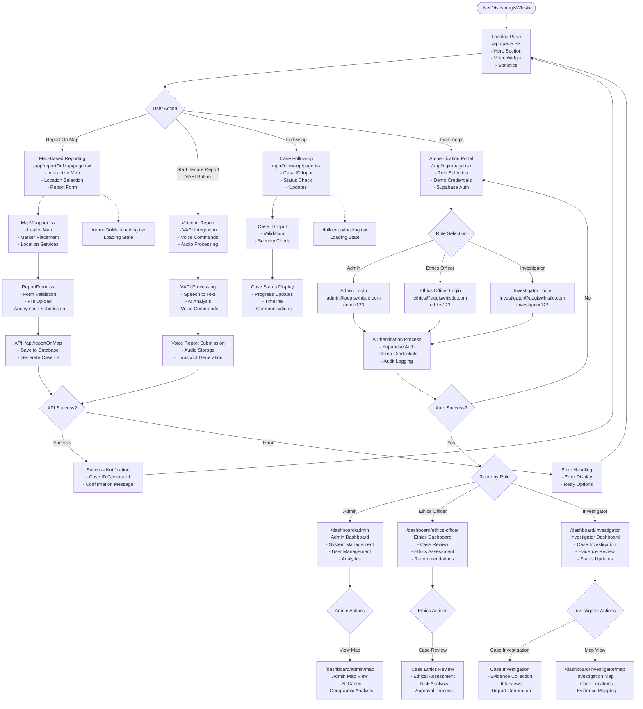

# Aegis v11 Technical Specification

## 📋 Document References

This technical specification includes references to interactive demos and supplementary documentation:

- **[Subscription Tiers Demo](../subscription-tiers-demo.html)** - Interactive HTML demo showcasing the complete subscription tier selection interface for Organization Administrators
- **[API-First Technical Document](API_FIRST_TECHNICAL_DOCUMENT.md)** - Comprehensive guide for frontend-agnostic architecture implementation
- **[Subscription Tier Frontend Flow](SUBSCRIPTION_TIER_FRONTEND_FLOW.md)** - Detailed frontend user experience flow documentation

## 1. Project Overview
Aegis v11 is a mobile-first web application built using Next.js 15.2.4, React 19, and TypeScript. The application is designed with responsive layouts and touch-optimized interfaces, serving as a reporting and mapping system with user authentication capabilities. All UI components and interactions are built with mobile devices as the primary target, ensuring optimal performance and usability across all screen sizes.
### 1.1 User Roles and Access Levels

Based on the comprehensive diagrams and user interface designs, the system supports the following detailed user roles:

#### 1. **Whistleblowers (Anonymous & Identified)**
   **Anonymous Whistleblowers:**
   - Can submit reports without authentication or identification
   - Choose anonymity level (Remain Anonymous - Recommended)
   - Access to voice conversation reporting via VAPI integration
   - Access to written report submission
   - File upload capability (max 5MB)
   - Receive anonymous tracking ID (e.g., XK7F9P2Q1R)
   - Can follow up on reports using anonymous ID
   - View blockchain transaction hash for report verification
   - No access to dashboard or organization features
   - All communications are end-to-end encrypted
   - IP addresses and metadata not logged for anonymous reports

   **Identified Whistleblowers:**
   - All anonymous features plus:
   - Can choose to identify themselves during reporting
   - Contact preference options (Email, Phone, Secure Inbox)
   - Enhanced follow-up capabilities
   - Direct communication with investigators
   - Notification preferences management
   - Report status tracking with detailed updates

   **Security Features:**
   - Voice data processed in-memory, not stored unless explicitly saved
   - Anonymous IDs generated client-side for maximum privacy
   - File uploads scanned for malware
   - Data stored on Hyperledger Fabric with access controls
   - Private data collections protect sensitive information

#### 2. **Ethics Officers**
   **Primary Responsibilities:**
   - Central oversight of all reported cases within organization
   - Case review and initial assessment
   - Investigator assignment and management
   - Reward pool management and distribution
   - Professional services marketplace access
   - Organization compliance monitoring

   **Dashboard Features:**
   - Case overview with status tracking (New Reports, Under Review, Assigned Cases, Resolved Cases)
   - Recent reports management with quick actions
   - Case assignment workflow (Assign, Review, Resolve)
   - Reward pool management (Available, Issued, Pending funds)
   - Professional services integration (Legal, Medical, Investigators, Specialists)
   - Real-time notifications and alerts

   **Workflow Capabilities:**
   1. Review new reports and categorize by type (Harassment, Fraud, Safety, etc.)
   2. Assign cases to appropriate investigators
   3. Monitor investigation progress and timelines
   4. Approve case resolutions and reward distributions
   5. Access professional marketplace for specialized services
   6. Generate compliance and analytics reports

   **Data Access:**
   - Full access to organization's case data
   - Audit logging of all actions
   - Secure communication channels with investigators
   - Encrypted access to sensitive case information

#### 3. **Investigators**
   **Primary Responsibilities:**
   - Detailed case investigation and evidence gathering
   - Direct communication with whistleblowers (when permitted)
   - Professional service coordination
   - Investigation documentation and reporting
   - Case status updates and progress tracking

   **Workspace Features:**
   - Case management dashboard (Assigned, In Progress, Pending Response, Completed)
   - Detailed case view with full transcript access
   - Investigation action tools (Query Whistleblower, Add Evidence, Request Professional Services)
   - Case timeline tracking with activity logs
   - Evidence repository management
   - Professional service request capabilities

   **Investigation Process:**
   1. Receive case assignment from Ethics Officer
   2. Review initial report and supporting materials
   3. Gather additional evidence and documentation
   4. Communicate with whistleblower through secure channels
   5. Consult with professional services when needed
   6. Document findings and recommendations
   7. Submit final investigation report

   **Professional Service Integration:**
   - Access to marketplace for specialized expertise
   - Service provider communication tools
   - Secure collaboration channels
   - Service request and approval workflow

#### 4. **Organization Administrators**
   **Primary Responsibilities:**
   - Initial organization setup and configuration after account activation
   - Organization profile creation with name and subdomain generation (<orgname>@aegiswhistle.com)
   - Organization-wide system configuration
   - Professional service provider selection and management per department
   - Team management and role assignments (Ethics Officers or Investigators)
   - Billing and subscription management
   - Compliance settings and monitoring
   - Analytics and reporting oversight

   **Admin Dashboard Features:**
   - Organization metrics (Active Cases, Total Reports, Reward Budget, Team Members)
   - Department overview (Department Count, Cases per Department, Department Performance)
   - Organization settings management (Subdomain, Anonymity Level, Reward Range, Crypto Options)
   - Department management (Create, Edit, Archive departments)
   - Team management (Ethics Officers, Investigators, role assignments per department)
   - Professional services provider management (marketplace)
   - Analytics and reporting tools (Organization-wide and per-department)
   - **Billing and subscription controls** (see [subscription-tiers-demo.html](../subscription-tiers-demo.html) for UI reference)

   **Management Capabilities:**
   - User invitation and role assignment per department
   - Department creation and configuration
   - Department-based Ethics Officer and Investigator pairing
   - **Subscription tier selection and management** - Interactive interface for plan comparison, usage monitoring, and tier upgrades (see [subscription-tiers-demo.html](../subscription-tiers-demo.html))
   - Subscription tier limits based on number of departments
   - Cross-department case escalation rules
   - Organization and department branding customization
   - Department-specific reward policy configuration
   - Professional service provider approval per department
   - Compliance monitoring and reporting (organization and department level)
   - System usage analytics with department breakdown

   **Configuration Options:**
   - Department structure and hierarchy
   - Anonymity levels per department (Encrypted, Anonymous, Identified)
   - Reward ranges and cryptocurrency options per department
   - Professional service categories per department
   - Team member permissions and department access
   - Inter-department communication settings
   - Department-specific notification preferences

#### 5. **Professional Service Providers**
   **Service Categories:**
   - Legal Services (Employment Law, Corporate Compliance, Workplace Harassment)
   - Medical Services (Workplace Health, Psychological Support)
   - Alternative Medicine and Specialized Services
   - Forensic Accounting and Cybersecurity
   - HR Consulting and Compliance

   **Provider Features:**
   - Verified credential system with licensing validation
   - Service profile management (Specializations, Hourly Rate, Availability)
   - Rating and review system
   - Secure communication channels
   - Service request management
   - Payment processing integration

   **Marketplace Integration:**
   - Search and discovery by specialization
   - Availability scheduling and booking
   - Secure case collaboration tools
   - Payment and billing management
   - Review and feedback system

#### 6. **AegisWhistle System Administrators**
   **Platform-Level Responsibilities:**
   - Multi-organization platform management
   - System health monitoring and maintenance
   - Security oversight and compliance
   - Platform-wide analytics and reporting
   - Technical support and troubleshooting

   **Administrative Capabilities:**
   - Organization approval and onboarding
   - Hyperledger Fabric network management
   - Certificate Authority management
   - Platform security monitoring
   - System performance optimization
   - Cross-organization data management (when authorized)

### 1.2 Enhanced User Flows

#### 1. **Voice Reporting Flow**
   ```
   Whistleblower Access Website
   ↓
   Click "Speak Up" Button
   ↓
   Choose Anonymity Level (Anonymous/Identified)
   ↓
   Select Report Method (Voice Conversation/Written)
   ↓
   VAPI Voice Agent Activation
   ↓
   Natural Conversation & Real-time Transcription
   ↓
   VAPI Returns Final Transcript
   ↓
   Store Transcript in Database
   ↓
   AI Summary & Automatic Categorization
   ↓
   Generate Anonymous Report ID
   ↓
   Store in configured database (PostgreSQL/MySQL/MongoDB/Hyperledger Fabric based on organization's subscription plan)
   ↓
   Display Tracking ID to Whistleblower
   ↓
   Make Transcript Visible in Respective Dashboards:
     - Whistleblower Dashboard
     - Investigator Dashboard
     - Ethics Officer Dashboard
   ↓
   Notify Ethics Officer of New Report
   ```

#### 2. **Video Reporting Flow**
   ```
   Whistleblower Access Website
   ↓
   Click "Speak Up" Button
   ↓
   Choose Anonymity Level (Anonymous/Identified)
   ↓
   Select Report Method (Video Interview/Written)
   ↓
   Tavus Video Agent Activation
   ↓
   AI Avatar Interview & Real-time Processing
   ↓
   Video Recording & Transcription
   ↓
   Tavus Returns Processed Video & Transcript
   ↓
   Store Video & Transcript in S3 Storage
   ↓
   AI Analysis & Emotional Intelligence Processing
   ↓
   Generate Anonymous Report ID
   ↓
   Store Metadata in configured database (PostgreSQL/MySQL/MongoDB/Hyperledger Fabric based on organization's subscription plan)
   ↓
   Display Tracking ID to Whistleblower
   ↓
   Make Video & Transcript Available in Respective Dashboards:
     - Whistleblower Dashboard
     - Investigator Dashboard
     - Ethics Officer Dashboard
   ↓
   Notify Ethics Officer of New Report
   ```

#### 2. **Professional Service Request Flow (marketplace)**
   ```
   Organizational Administrator logs in with organization-provided credentials
   ↓
   Access Professional Services Dashboard
   ↓
   Filter by Service Category & Specialization (Organization Administrator)
   ↓
   Review Provider Profiles (Credentials, Ratings, Availability)
   ↓
   Select Provider & Submit Service Request
   ↓
   Provider Notification & Response
   ↓
   Service Confirmation & Case Linking
   ↓
   Secure Collaboration Channel Creation
   ↓
   Service Delivery & Documentation
   ↓
   Payment Processing & Review Submission
   ```

#### 3. **Reward Processing Flow**
   ```
   Ethics Officer Case Review
   ↓
   Approve Reward Amount (e.g., $500 USDC)
   ↓
   Check Organization Wallet Balance
   ↓
   Generate Anonymous Crypto Wallet
   ↓
   Transfer Cryptocurrency to Anonymous Wallet
   ↓
   Record Transaction in Hyperledger Fabric
   ↓
   Send Claim Instructions to Whistleblower
   ↓
   Whistleblower Claims Reward (Optional)
   ```

#### 4. **Organization Onboarding Flow**
   ```
   Organizational Administrator Registration
   ↓
   Organization Information Submission
   ↓
   Platform Admin Review & Approval
   ↓
   Select Subscription Tier (Core, Voice Agent, Enterprise, etc.)
   ↓
   Initialize Organization Infrastructure Based on Tier
   ↓
   Organization Activation & Configuration
   ↓
   Organizational Admin Settings Configuration
   ↓
   Team Member Invitation & Role Assignment (ethics officer , investigator)
   ↓
   Professional Service Provider Setup ( pick the professional service provider from the market place and make the required payments)
   ↓
   Go-Live & Training
   ```

#### 5. **Case Management Flow**
   ```
   New Report Submission
   ↓
   Ethics Officer Review & Categorization
   ↓
   Case Assignment to Investigator
   ↓
   Investigation Planning & Evidence Gathering
   ↓
   Professional Service Consultation (if needed)
   ↓
   Whistleblower Communication (if permitted)
   ↓
   Investigation Documentation & Findings
   ↓
   Ethics Officer Review & Resolution Approval
   ↓
   Case Closure & Reward Processing
   ↓
   Final Documentation & Compliance Reporting
   ```

## 2. Core Infrastructure

### 2.1 System Architecture

#### 2.1.1 High-Level Architecture Overview

```
┌─────────────────────────────────────────────────────────────────────────────────────┐
│                                                                                     │
│                     AEGISWHISTLE SAAS PLATFORM                                      │
│                                                                                     │
├─────────────────────────────────────────────────────────────────────────────────────┤
│  ┌───────────────────────────────────────────────────────────────────────────────┐  │
│  │                           FRONTEND LAYER                                      │  │
│  │  ┌─────────────────────┐  ┌─────────────────────┐  ┌─────────────────────┐  │  │
│  │  │  Public Landing     │  │  Organization       │  │  Admin Dashboard    │  │  │
│  │  │  • Marketing Site   │  │  Portals            │  │  • System Health    │  │  │
│  │  │  • Documentation    │  │  • {org}.aegiswhistle│  │  • User Management  │  │  │
│  │  │  • Signup Flows     │  │  • Custom Branding   │  │  • Analytics        │  │  │
│  │  └─────────────────────┘  └─────────────────────┘  └─────────────────────┘  │  │
│  │                                                                               │  │
│  │  ┌─────────────────────────────────────────────────────────────────────┐      │  │
│  │  │                  Professional Marketplace                          │      │  │
│  │  │  • Service Provider Directory  • Booking System  • Reviews & Ratings  │      │  │
│  │  └─────────────────────────────────────────────────────────────────────┘      │  │
│  └───────────────────────────────────────────────────────────────────────────────┘  │
├─────────────────────────────────────────────────────────────────────────────────────┤
│  ┌───────────────────────────────────────────────────────────────────────────────┐  │
│  │                    API GATEWAY & SECURITY LAYER                             │  │
│  │  ┌───────────────┐  ┌────────────────┐  ┌─────────────────┐  ┌───────────┐  │  │
│  │  │ Authentication│  │ Rate Limiting  │  │ Request         │  │ API       │  │  │
│  │  │ • JWT         │  │ • DDoS         │  │ Validation      │  │ Versioning│  │  │
│  │  │ • OAuth 2.0   │  │ Protection     │  │ • Schema        │  │ • v1, v2  │  │  │
│  │  │ • MFA         │  │ • Throttling   │  │   Validation   │  │ • Deprecation│  │  │
│  │  └───────────────┘  └────────────────┘  └─────────────────┘  └───────────┘  │  │
│  │  ┌─────────────────────────────────────────────────────────────────────┐      │  │
│  │  │                      Multi-tenant Request Router                    │      │  │
│  │  │  • Tenant Identification  • Request Context  • Data Isolation       │      │  │
│  │  └─────────────────────────────────────────────────────────────────────┘      │  │
│  │  ┌─────────────────────────────────────────────────────────────────────┐      │  │
│  │  │                    API Documentation & Testing                      │      │  │
│  │  │  • Swagger/OpenAPI 3.0  • Interactive Testing  • Schema Validation  │      │  │
│  │  └─────────────────────────────────────────────────────────────────────┘      │  │
│  └───────────────────────────────────────────────────────────────────────────────┘  │
├─────────────────────────────────────────────────────────────────────────────────────┤
│  ┌───────────────────────────────────────────────────────────────────────────────┐  │
│  │                       CORE BACKEND SERVICES                                 │  │
│  │  ┌─────────────────────┐  ┌─────────────────────┐  ┌─────────────────────┐  │  │
│  │  │ Organization        │  │ User Management     │  │ Voice Processing    │  │  │
│  │  │ • Tenant Onboarding │  │ • RBAC             │  │ • VAPI Integration  │  │  │
│  │  │ • Configuration     │  │ • Profile Management│  │ • Transcription     │  │  │
│  │  │ • Billing          │  │ • Audit Logs       │  │ • AI Conversation   │  │  │
│  │  └─────────────────────┘  └─────────────────────┘  └─────────────────────┘  │  │
│  │  ┌─────────────────────┐  ┌─────────────────────┐  ┌─────────────────────┐  │  │
│  │  │ Blockchain Service  │  │ Notification        │  │ Payment Service     │  │  │
│  │  │ • Smart Contracts   │  │ • Email/SMS         │  │ • Crypto Rewards    │  │  │
│  │  │ • Chaincode         │  │ • Real-time Alerts  │  │ • Fiat Processing   │  │  │
│  │  │ • Immutable Ledger  │  │ • Webhooks         │  │ • Wallet Management │  │  │
│  │  └─────────────────────┘  └─────────────────────┘  └─────────────────────┘  │  │
│  │  ┌─────────────────────────────────────────────────────────────────────┐      │  │
│  │  │                     Marketplace Service                            │      │  │
│  │  │  • Service Provider Onboarding  • Billing  • Dispute Resolution    │      │  │
│  │  └─────────────────────────────────────────────────────────────────────┘      │  │
│  └───────────────────────────────────────────────────────────────────────────────┘  │
├─────────────────────────────────────────────────────────────────────────────────────┤
│  ┌───────────────────────────────────────────────────────────────────────────────┐  │
│  │                           DATA LAYER                                        │  │
│  │  ┌─────────────────────┐  ┌─────────────────────┐  ┌─────────────────────┐  │  │
│  │  │ PostgreSQL         │  │ Redis               │  │ Object Storage      │  │  │
│  │  │ • User Data        │  │ • Caching           │  │ • Evidence Files    │  │  │
│  │  │ • Application State│  │ • Rate Limiting     │  │ • Document Storage  │  │  │
│  │  │ • Multi-tenant     │  │ • Real-time Events  │  │ • Media Assets      │  │  │
│  │  └─────────────────────┘  └─────────────────────┘  └─────────────────────┘  │  │
│  └───────────────────────────────────────────────────────────────────────────────┘  │
├─────────────────────────────────────────────────────────────────────────────────────┤
│  ┌───────────────────────────────────────────────────────────────────────────────┐  │
│  │                       BLOCKCHAIN LAYER                                      │  │
│  │  ┌─────────────────────────────────────────────────────────────────────┐      │  │
│  │  │                  Per-Organization Networks                          │      │  │
│  │  │  ┌───────────────┐  ┌────────────────┐  ┌─────────────────┐  │      │  │
│  │  │  │ Org A         │  │ Org B          │  │ Org N           │  │      │  │
│  │  │  │ • Peers       │  │ • Peers        │  │ • Peers         │  │      │  │
│  │  │  │ • Orderers    │  │ • Orderers     │  │ • Orderers      │  │      │  │
│  │  │  │ • CA          │  │ • CA           │  │ • CA            │  │      │  │
│  │  │  └───────────────┘  └────────────────┘  └─────────────────┘  │      │  │
│  │  └─────────────────────────────────────────────────────────────────────┘      │  │
│  │  ┌─────────────────────────────────────────────────────────────────────┐      │  │
│  │  │                  Cross-Network Bridge (Optional)                   │      │  │
│  │  │  • Secure Data Sharing  • Selective Disclosure  • Audit Trail      │      │  │
│  │  └─────────────────────────────────────────────────────────────────────┘      │  │
│  └───────────────────────────────────────────────────────────────────────────────┘  │
├─────────────────────────────────────────────────────────────────────────────────────┤
│  ┌───────────────────────────────────────────────────────────────────────────────┐  │
│  │                       EXTERNAL INTEGRATIONS                                │  │
│  │  ┌───────────────┐  ┌────────────────┐  ┌─────────────────┐  ┌───────────┐  │  │
│  │  │ AI/ML         │  │ Payment        │  │ Identity        │  │ Email/SMS │  │  │
│  │  │ • VAPI        │  │ • Crypto Wallets│  │ • Verification  │  │ • SendGrid │  │  │
│  │  │ • Tavus Video │  │ • Stripe        │  │ • KYC/AML       │  │ • Twilio   │  │  │
│  │  │ • NLP Models  │  │ • Plaid         │  │ • OAuth         │  │ • AWS SES  │  │  │
│  │  └───────────────┘  └────────────────┘  └─────────────────┘  └───────────┘  │  │
│  └───────────────────────────────────────────────────────────────────────────────┘  │
└─────────────────────────────────────────────────────────────────────────────────────┘
```

#### 2.1.2 Detailed Architecture Diagram

```mermaid
graph TD
    %% Main Components
    subgraph "AegisWhistle Platform"
        FE[Frontend Layer]
        API[API Gateway]
        AUTH[Authentication Service]
        ORG[Organization Service]
        VOICE[Voice Processing Service]
        VIDEO[Video Agent Service]
        BLOCK[Blockchain Service]
        NOTIF[Notification Service]
        PAY[Payment Service]
        MRKT[Marketplace Service]
        SWAGGER[API Documentation]
        
        %% Data Stores
        subgraph "Data Layer"
            PG[(PostgreSQL)]
            REDIS[(Redis)]
            S3[(S3 Storage)]
        end
        
        %% Blockchain Networks
        subgraph "Blockchain Layer"
            HL1[Organization 1<br/>Hyperledger Network]
            HL2[Organization 2<br/>Hyperledger Network]
            HL3[Organization N<br/>Hyperledger Network]
        end
    end
    
    %% External Services
    VAPI[VAPI Voice AI]
    TAVUS[Tavus Video AI]
    WALLET[Crypto Wallets]
    PAYPROC[Payment Processors]
    IDV[Identity Verification]
    
    %% User Interactions
    WB[Whistleblower] -->|1. Submit Report| FE
    EO[Ethics Officer] -->|2. Review Case| FE
    INV[Investigator] -->|3. Investigate| FE
    SP[Service Provider] -->|4. Marketplace| FE
    
    %% Internal Connections
    FE -->|API Calls| API
    API --> SWAGGER
    API --> AUTH
    API --> ORG
    API --> VOICE
    API --> VIDEO
    API --> BLOCK
    API --> NOTIF
    API --> PAY
    API --> MRKT
    
    %% Service to Data Store Connections
    AUTH --> PG
    ORG --> PG
    VOICE --> S3
    VIDEO --> S3
    MRKT --> PG
    BLOCK --> HL1 & HL2 & HL3
    
    %% External Integrations
    VOICE --> VAPI
    VIDEO --> TAVUS
    PAY --> WALLET & PAYPROC
    AUTH --> IDV
    
    %% Styling
    classDef platform fill:#f9f9f9,stroke:#333,stroke-width:2px
    classDef data fill:#e6f3ff,stroke:#1a73e8
    classDef blockchain fill:#e8f5e9,stroke:#2e7d32
    classDef external fill:#fff3e0,stroke:#f57c00
    
    class PG,REDIS,S3 data
    class HL1,HL2,HL3 blockchain
    class VAPI,TAVUS,WALLET,PAYPROC,IDV,WB,EO,INV,SP external
```



#### 2.1.3 Component Descriptions

**1. Frontend Layer (Next.js 15.2.4 + React 19)**
- **Public Landing Pages**: Marketing site, documentation, and signup flows
- **Organization Portals**: Tenant-specific interfaces at `{org}.aegiswhistle.com`
- **Admin Dashboard**: System administration and monitoring
- **Professional Marketplace**: Directory of vetted service providers

**2. API Gateway & Core Services**
- **Authentication Service**: JWT-based auth, session management, multi-tenant support
- **Organization Service**: Multi-tenant management and configuration
- **Voice Processing Service**: VAPI integration for voice report transcription and analysis
- **Video Agent Service**: Tavus integration for video avatar interactions
- **Blockchain Service**: Manages interactions with Hyperledger networks
- **Notification Service**: Real-time alerts and communications
- **Payment Service**: Crypto rewards and payment processing
- **Marketplace Service**: Professional services directory and booking
- **API Documentation**: Swagger/OpenAPI 3.0 for interactive API testing

**3. Data Layer**
- **PostgreSQL**: Primary operational database with tenant isolation
- **Redis**: Caching, rate limiting, and real-time features
- **S3 Storage**: Secure file storage for evidence and documents

**4. Blockchain Layer**
- **Dedicated Hyperledger Networks**: One per organization
- **Smart Contracts**: Custom chaincode for complaint management
- **Private Data Collections**: For sensitive information

#### 2.1.4 Data Flow

1. **Whistleblower Submission Flow**:
   - User submits report via web/mobile interface
   - Voice reports processed by VAPI AI
   - Video interactions handled by Tavus avatars
   - Report hashed and stored on blockchain
   - Confirmation and tracking ID provided

2. **Case Management Flow**:
   - Ethics Officer reviews and assigns cases
   - Investigators access case details
   - Evidence collected and linked to blockchain
   - Professional services booked through marketplace
   - Resolution and reward processing

3. **Marketplace Operations**:
   - Service providers register and verify credentials
   - Organizations search and book professional services
   - Secure communication channels established
   - Payment processing and commission handling

#### 2.1.5 Security Architecture

- **Network Security**:
  - VPC isolation for each environment
  - Web Application Firewall (WAF) protection
  - DDoS mitigation and rate limiting
  
- **Data Protection**:
  - Encryption at rest and in transit
  - Hardware Security Modules (HSM) for key management
  - Regular security audits and penetration testing
  
- **Compliance**:
  - SOC 2 Type II certification
  - GDPR compliance for EU users
  - HIPAA compliance for healthcare organizations

#### 2.1.6 Subscription Tiers

> **📋 UI Reference**: For a complete visual representation of the subscription tier selection interface, see the interactive demo: [`subscription-tiers-demo.html`](../subscription-tiers-demo.html)
> 
> This demo showcases:
> - Interactive plan comparison cards with hover effects
> - Real-time usage metrics dashboard
> - Department structure examples
> - Feature comparison table
> - Mobile-responsive design
> - Organization Administrator workflow

**Package 1: Core (Free Tier)**
- **Core Infrastructure**: Essential security and compliance features including:
  - JWT authentication
  - Role-based access control
  - Basic audit logging
  - Standard API endpoints
  - Email notification system
  - Basic data encryption
- **Database**: Basic PostgreSQL with 1,000 records limit
- **Departments**: 1 department maximum
- **Users**: Up to 10 users per organization (5 per department)
- **Department Structure**: 1 Ethics Officer + 2 Investigators per department
- **Features**: 
  - Basic reporting: Up to 50 whistleblower reports per month
  - Report types: Text-based reports only
  - Email notifications for new reports and updates
  - Standard dashboard with basic metrics
  - Basic report tracking and status updates
- **Storage**: 1GB file storage for report attachments
- **Database Options**: PostgreSQL only
- **Support**: Community support via GitHub issues and forums

**Package 2: Core + Voice Agent ($99/month)**
- **Everything in Core** +
- **Voice Agent Module**: VAPI integration for voice reporting
- **Database**: 10,000 records limit
- **Departments**: Up to 3 departments
- **Users**: Up to 50 users per organization (15-17 per department)
- **Department Structure**: 1 Ethics Officer + 4 Investigators per department
- **Features**: 
  - Voice-to-text reporting
  - AI conversation guidance
  - Up to 200 whistleblower reports per month
  - Report types: Text and voice-based reports
- **Storage**: 10GB file storage
- **Database Options**: PostgreSQL, MySQL
- **Support**: Email support

**Package 3: Core + Video Agent ($149/month)**
- **Everything in Core** +
- **Video Agent Module**: Tavus integration for video interviews
- **Database**: 10,000 records limit
- **Departments**: Up to 3 departments
- **Users**: Up to 50 users per organization (15-17 per department)
- **Department Structure**: 1 Ethics Officer + 4 Investigators per department
- **Features**: 
  - Video avatar interactions
  - Visual reporting
  - Up to 500 whistleblower reports per month
  - Report types: Text, voice, and video-based reports
- **Storage**: 25GB file storage (video requires more space)
- **Database Options**: PostgreSQL, MySQL, MongoDB
- **Support**: Email support

**Package 4: Professional ($299/month)**
- **Everything in Core** +
- **Voice Agent Module** +
- **Advanced Blockchain Module** +
- **Advanced Analytics Module** +
- **Professional Marketplace Module** (Limited Access)
- **Database**: 100,000 records limit
- **Departments**: Up to 10 departments
- **Users**: Up to 200 users per organization (20 per department)
- **Department Structure**: 2 Ethics Officers + 6 Investigators per department
- **Features**: 
  - Hyperledger Fabric
  - Custom dashboards
  - Detailed analytics
  - Basic marketplace access
  - Up to 1,000 whistleblower reports per month
- **Marketplace**: Access to vetted service providers, basic booking system
- **Storage**: 100GB file storage
- **Database Options**: PostgreSQL, MySQL, MongoDB, Hyperledger Fabric
- **Support**: Priority email + chat support

**Package 5: Enterprise ($599/month)**
- **All Modules Included** (Voice, Video, Blockchain, Analytics, Rewards, Full Marketplace)
- **Database**: Unlimited records
- **Departments**: Unlimited departments
- **Users**: Unlimited users
- **Department Structure**: Flexible staffing - unlimited Ethics Officers and Investigators per department
- **Features**: Full feature set, custom integrations, complete marketplace ecosystem
- **Whistleblower Reports**: Unlimited reports per month
- **Report Types**: All supported formats (Text, Voice, Video)
- **Marketplace**: Full marketplace access, provider verification, payment processing, commission management
- **Storage**: 500GB file storage
- **Database Options**: All supported databases (PostgreSQL, MySQL, MongoDB, Hyperledger Fabric, custom)
- **Support**: Dedicated account manager + phone support

**Department-Based Features:**
- **Department Isolation**: Each department operates independently with its own case management
- **Cross-Department Reporting**: Higher tiers allow cases to be escalated across departments
- **Department Analytics**: Separate analytics dashboards for each department
- **Role Assignment**: Ethics Officers and Investigators are assigned to specific departments
- **Department Branding**: Each department can have custom branding (Professional tier and above)
- **Inter-Department Communication**: Secure messaging between departments (Enterprise tier)

**Frontend Implementation Reference:**
The subscription tier selection and management interface is fully implemented and demonstrated in [`subscription-tiers-demo.html`](../subscription-tiers-demo.html). This interactive demo includes:

- **Plan Comparison Interface**: Side-by-side comparison of all subscription tiers with feature highlights
- **Usage Metrics Dashboard**: Real-time monitoring of department, user, report, and storage limits
- **Interactive Plan Selection**: Hover effects, recommended badges, and selection workflows
- **Department Configuration Examples**: Visual representation of department structures per tier
- **Responsive Design**: Mobile-first approach with adaptive layouts
- **Accessibility Features**: Screen reader support, keyboard navigation, and WCAG compliance
- **State Management**: React-based state handling for plan selection and configuration
- **API Integration Points**: Defined endpoints for subscription management and billing

**Technical Implementation Notes:**
- Built with Tailwind CSS for consistent styling and responsive design
- Uses Lucide icons for visual consistency across the platform
- Implements progressive enhancement for accessibility
- Includes usage warning systems when approaching tier limits
- Features smooth animations and transitions for enhanced user experience
- Supports both monthly and annual billing cycles with discount visualization

#### 2.1.7 Legacy Architecture Support
- **Monolithic Application with Microservices Support**
  - Next.js application as the main container
  - Modular architecture for easy service extraction
  - API-first design for future service separation

- **Infrastructure Components**
  - **Application Server**: Next.js server
  - **Database Server**: Supabase/PostgreSQL
  - **File Storage**: Supabase Storage
  - **Cache Layer**: Built-in Next.js caching
  - **CDN**: Vercel Edge Network (if deployed on Vercel)

### 2.2 Core Services
1. **Authentication Service**
   - Supabase Auth integration
   - JWT token management
   - Session handling
   - Role-based access control

2. **Data Service**
   - Database connection management
   - Query optimization
   - Data validation
   - Real-time subscriptions

3. **File Service**
   - File upload/download
   - Image processing
   - Document management
   - Storage optimization

4. **Notification Service**
   - Real-time notifications
   - Email notifications
   - Push notifications
   - In-app alerts

### 2.3 Infrastructure Security
- **Network Security**
  - HTTPS/TLS encryption
  - API rate limiting
  - DDoS protection
  - Firewall rules

- **Data Security**
  - End-to-end encryption
  - Data backup strategy
  - Disaster recovery plan
  - Audit logging

## 3. Plug-and-Play Features

### 3.1 Core Modules
1. **User Management Module**
   - User registration and authentication
   - Multi-role profile management (Whistleblowers, Ethics Officers, Investigators, Admins)
   - Role-based access control (RBAC)
   - Permission system with granular controls
   - Integration points for custom user fields
   - Anonymous user handling and tracking

2. **Voice Reporting Module**
   - VAPI voice agent integration for natural conversation
   - Gemini Live AI fallback for voice processing
   - Real-time voice transcription and analysis
   - AI-powered conversation guidance
   - Voice data security and privacy controls
   - Multi-language support for voice reporting

3. **Professional Marketplace Module**
   - Service provider directory and management
   - Credential verification and licensing validation
   - Service categorization (Legal, Medical, Specialized Services)
   - Provider rating and review system
   - Booking and scheduling system
   - Secure communication channels
   - Payment processing and commission management
   - Service request workflow automation

4. **Reporting Module**
   - Multi-method report creation (Voice, Written, File Upload)
   - Anonymous and identified reporting options
   - Report categorization and tagging
   - Evidence management and file handling
   - Report status tracking and timeline
   - Blockchain integration for immutable records
   - Custom report templates and workflows

5. **Case Management Module**
   - Case assignment and workflow management
   - Investigation tracking and documentation
   - Evidence repository and chain of custody
   - Communication tools for case stakeholders
   - Case timeline and activity logging
   - Resolution and closure workflows
   - Compliance and audit trail management

6. **Reward System Module**
   - Cryptocurrency wallet integration (USDC, ETH)
   - Anonymous reward distribution
   - Reward pool management and budgeting
   - Automated reward calculation and approval
   - Blockchain transaction recording
   - Multi-currency support and conversion

7. **Map Integration Module**
   - Interactive map interface for location-based reporting
   - Custom marker support for incident locations
   - Geographic data visualization
   - Geofencing and location services
   - Privacy controls for location data
   - Integration with reporting workflows

8. **Analytics Module**
   - Real-time dashboard with key metrics
   - Case analytics and trend analysis
   - Organization performance metrics
   - Custom report generation
   - Data visualization and charting
   - Export capabilities for compliance reporting

### 3.2 Extensible Components
1. **UI Component Library**
   - Theme customization
   - Component extension
   - Custom styling
   - Responsive design
   - Accessibility support

2. **API Gateway**
   - Custom endpoint creation
   - Middleware support
   - Rate limiting
   - Request/Response transformation
   - API documentation

3. **Integration Framework**
   - Third-party service integration
   - Webhook support
   - Custom connector development
   - Data synchronization
   - Event handling

### 3.3 Feature Flags
- Feature toggle system
- A/B testing support
- Gradual rollout capability
- Environment-specific features
- User-specific feature access

### 3.4 Plugin System
1. **Plugin Architecture**
   - Plugin registration
   - Plugin lifecycle management
   - Plugin configuration
   - Plugin dependencies
   - Plugin isolation

2. **Available Plugin Types**
   - UI plugins
   - Data source plugins
   - Authentication plugins
   - Integration plugins
   - Custom plugins

3. **Plugin Development**
   - Plugin SDK
   - Development guidelines
   - Testing framework
   - Documentation
   - Example plugins

### 3.5 Integration Points
1. **External Services**
   - Authentication providers
   - Payment gateways
   - Communication services
   - Storage services
   - Analytics services

2. **Custom Integrations**
   - Custom API endpoints
   - Webhook handlers
   - Event listeners
   - Data transformers
   - Custom middleware

## 4. Technology Stack

### 4.1 Core Technologies
- **Framework**: Next.js 15.2.4
- **Language**: TypeScript
- **UI Library**: React 19
- **Database**: Supabase (based on @supabase/supabase-js integration)
- **Styling**: Tailwind CSS with custom animations
- **Form Handling**: React Hook Form with Zod validation

### 4.2 UI Components
The application uses a comprehensive set of Radix UI components for building accessible and customizable UI elements:
- Navigation components (Menu, Tabs, Accordion)
- Form elements (Input, Select, Checkbox, Radio)
- Feedback components (Toast, Alert Dialog)
- Layout components (Scroll Area, Separator)
- Interactive components (Slider, Progress, Toggle)

### 4.3 Additional Libraries
- **Maps**: Leaflet with React Leaflet integration
- **Charts**: Recharts for data visualization
- **Date Handling**: date-fns
- **Icons**: Lucide React and React Icons
- **Theming**: next-themes for dark/light mode support

## 5. Application Structure

### 5.1 Directory Structure
```
aegisv11/
├── frontend/                    # Frontend application
│   ├── src/
│   │   ├── app/               # Next.js app directory
│   │   │   ├── api/          # API routes
│   │   │   ├── dashboard/    # Dashboard pages
│   │   │   ├── follow-up/    # Follow-up feature pages
│   │   │   ├── login/       # Authentication pages
│   │   │   ├── report/      # Report management
│   │   │   └── reportOnMap/ # Map-based reporting
│   │   ├── components/       # Reusable UI components
│   │   ├── hooks/           # Custom React hooks
│   │   ├── lib/             # Utility functions and configurations
│   │   ├── public/          # Static assets
│   │   └── styles/          # Global styles and Tailwind configuration
│   ├── tests/               # Frontend test files
│   └── package.json         # Frontend dependencies
│   |
│   ├── src/
│   │   ├── core/                    # Core application modules
│   │   │   ├── routes/             # Core API routes
│   │   │   ├── controllers/        # Core controllers
│   │   │   ├── middleware/         # Core middleware
│   │   │   ├── services/           # Core business logic
│   │   │   ├── models/             # Core data models
│   │   │   ├── cache/             # Redis cache layer
│   │   │   ├── database/          # Database connections & migrations
│   │   │   ├── notifications/     # Notification service
│   │   │   └── utils/              # Core utilities
│   │   │
│   │   ├── modules/                # Pluggable feature modules
│   │   │   ├── auth/              # Authentication module
│   │   │   │   ├── routes/
│   │   │   │   ├── controllers/
│   │   │   │   ├── middleware/
│   │   │   │   ├── cache/        # Auth-specific caching
│   │   │   │   └── services/
│   │   │   │
│   │   │   ├── reporting/         # Reporting module
│   │   │   │   ├── routes/
│   │   │   │   ├── controllers/
│   │   │   │   ├── cache/        # Report caching
│   │   │   │   ├── notifications/ # Report notifications
│   │   │   │   └── services/
│   │   │   │
│   │   │   └── maps/             # Maps integration module
│   │   │       ├── routes/
│   │   │       ├── controllers/
│   │   │       ├── cache/        # Map data caching
│   │   │       └── services/
│   │   │
│   │   ├── config/                # Application configuration
│   │   │   ├── database.js        # Database config
│   │   │   ├── cache.js          # Redis cache config
│   │   │   ├── notifications.js   # Notification service config
│   │   │   ├── auth.js
│   │   │   └── modules.js         # Module configuration
│   │   │
│   │   ├── utils/                 # Shared utilities
│   │   │   ├── logger.js
│   │   │   ├── errors.js
│   │   │   └── helpers.js
│   │   │
│   │   ├── app.js                 # Main application setup
│   │   └── server.js              # Server entry point
│   ├── tests/                # Backend test files
│   └── requirements.txt      # Python dependencies
│
├── deployment/                 # Deployment configuration
│   ├── docker/
│   │   ├── frontend.Dockerfile
│   │   └── backend.Dockerfile
│   ├── kubernetes/
│   │   ├── frontend-deployment.yaml
│   │   └── backend-deployment.yaml
│   └── scripts/
│       ├── deploy.py         # Python deployment script
│       └── health_check.py   # Health check script
│
└── docs/                      # Documentation
    ├── api/                  # API documentation
    ├── setup/               # Setup guides
    └── architecture/        # Architecture diagrams
```

### 5.2 Key Features
1. **Authentication System**
   - Login functionality
   - User session management

2. **Dashboard**
   - Main application interface
   - Data visualization and reporting

3. **Reporting System**
   - Report creation and management
   - Map-based reporting interface
   - Follow-up tracking system

4. **Map Integration**
   - Interactive map interface
   - Location-based reporting
   - Geographic data visualization

## 6. Frontend Architecture

### 6.1 Component Structure
- **UI Components (`/components/ui/`)**
  - Reusable UI elements built with Radix UI
  - Custom styled components using Tailwind CSS
  - Theme-aware components supporting dark/light modes

- **Layout Components**
  - `dashboard-layout.tsx`: Main application layout with navigation
  - Responsive design patterns
  - Dynamic content areas

### 6.2 Role-Specific Interface Components

#### 6.2.1 Whistleblower Interface Components
- **Landing Page Components**
  - Organization branding header with custom subdomain support
  - "Speak Up" primary action button with voice integration
  - Anonymity selection interface (Anonymous/Identified options)
  - Report method selection (Voice Conversation/Written Report)
  - Real-time case statistics display (Open Cases, Resolved Cases, Rewards Issued, Bounty Available)

- **Voice Reporting Components**
  - VAPI voice widget with recording controls
  - Real-time transcription display
  - Voice conversation guidance interface
  - Audio quality indicators and controls

- **Report Submission Components**
  - Multi-step form with progress indicators
  - File upload component with drag-and-drop (max 5MB)
  - Contact preference selection for identified users
  - Anonymous ID generation and display
  - Blockchain transaction hash display with explorer link

- **Follow-up Components**
  - Report status tracking interface
  - Anonymous ID verification system
  - Secure communication portal
  - Update notification center

#### 6.2.2 Ethics Officer Dashboard Components
- **Overview Dashboard**
  - Key metrics cards (New Reports, Under Review, Assigned Cases, Resolved Cases)
  - Recent reports list with quick action buttons
  - Case assignment interface with investigator selection
  - Priority and urgency indicators

- **Case Management Components**
  - Case detail view with full transcript access
  - Case categorization and tagging interface
  - Investigation assignment workflow
  - Status update and progress tracking

- **Reward Management Components**
  - Reward pool overview (Available, Issued, Pending)
  - Reward approval interface with amount selection
  - Cryptocurrency wallet integration
  - Transaction history and audit trail

- **Professional Services Integration**
  - Marketplace access portal
  - Service provider directory
  - Service request management
  - Provider communication interface

#### 6.2.3 Investigator Workspace Components
- **Case Dashboard**
  - Assigned cases overview with status indicators
  - Case priority and deadline tracking
  - Investigation progress visualization
  - Task and milestone management

- **Investigation Tools**
  - Case detail viewer with evidence repository
  - Timeline and activity log interface
  - Evidence upload and management system
  - Secure communication tools

- **Professional Service Request**
  - Service provider search and filter interface
  - Provider profile and credential viewer
  - Service request submission form
  - Collaboration workspace for external experts

#### 6.2.4 Organization Admin Dashboard Components
- **Organization Overview**
  - Key organizational metrics (Active Cases, Total Reports, Reward Budget, Team Members)
  - System health and usage analytics
  - Compliance status indicators
  - Performance trend visualization

- **Team Management Interface**
  - User role assignment and management
  - Team member invitation system
  - Permission and access control configuration
  - Activity and performance monitoring

- **Configuration Management**
  - Organization settings (Subdomain, Anonymity Level, Reward Range)
  - Cryptocurrency options configuration
  - Professional service provider management
  - Branding and customization tools

#### 6.2.5 Professional Marketplace Components
- **Provider Directory**
  - Service category filtering (Legal, Medical, Specialized)
  - Provider search with specialization filters
  - Provider profile cards with ratings and availability
  - Credential verification badges

- **Service Request Interface**
  - Service request form with case linking
  - Provider selection and comparison tools
  - Availability calendar and scheduling
  - Secure communication setup

- **Provider Management**
  - Provider profile management
  - Credential upload and verification
  - Availability and scheduling management
  - Rating and review system

### 6.3 Advanced UI Features

#### 6.3.1 Voice Integration Components
- **VAPI Voice Widget**
  - Voice recording controls with visual feedback
  - Real-time transcription display
  - Conversation flow management
  - Audio quality monitoring
  - Privacy controls and data handling

#### 6.3.2 Blockchain Integration Components
- **Transaction Display**
  - Blockchain transaction hash viewer
  - Explorer link integration
  - Transaction status indicators
  - Immutable record verification

#### 6.3.3 Security and Privacy Components
- **Anonymity Controls**
  - Anonymous ID generation and display
  - Privacy level selection interface
  - Data encryption status indicators
  - Secure communication portals

#### 6.3.4 Real-time Features
- **Live Updates**
  - Real-time case status updates
  - Live notification system
  - Activity feed with real-time updates
  - Collaborative workspace features

- **Feature Components**
  - Voice integration components (`vapi-voice-widget.tsx`, `vapi-launcher.tsx`)
  - Theme management (`theme-provider.tsx`)
  - Demo components for testing and development

### 6.2 State Management
- React Hooks for local state management
- Custom hooks for shared logic
- Form state management using React Hook Form
- Theme state management with next-themes

### 6.3 Routing and Navigation
- Next.js App Router implementation
- Dynamic route handling
- Protected routes for authenticated users
- Nested layouts for different sections

### 6.4 UI/UX Features
- Responsive design using Tailwind CSS
- Dark/light theme support
- Loading states and transitions
- Error boundaries and fallback UI
- Toast notifications for user feedback
- Interactive maps using Leaflet
- Data visualization with Recharts

## 7. Actual Frontend User Flow & Component Architecture

### 7.1 Frontend User Flow Diagram



### 7.2 Component Interaction Diagram

```mermaid
graph TB
    subgraph "Landing Page (/app/page.tsx)"
        LP["Landing Page Component<br/>- Hero Section<br/>- Navigation<br/>- Statistics<br/>- Feature Cards"]
        VW["VapiVoiceWidget<br/>(/components/vapi-voice-widget.tsx)"]
        VL["VapiLauncher<br/>(/components/vapi-launcher.tsx)"]
        LP --> VW
        LP --> VL
    end
    
    subgraph "Authentication (/app/login/page.tsx)"
        LA["Login Page<br/>- Role Selection<br/>- Demo Credentials<br/>- Form Validation"]
        SB["Supabase Client<br/>(/lib/supabase)"]
        AL["Audit Logger<br/>(/lib/audit-logger)"]
        LA --> SB
        LA --> AL
    end
    
    subgraph "Map Reporting (/app/reportOnMap/)"
        MRP["Map Report Page<br/>(page.tsx)"]
        MW["MapWrapper<br/>(MapWrapper.tsx)<br/>- Leaflet Integration<br/>- Marker Management"]
        RF["ReportForm<br/>(ReportForm.tsx)<br/>- Form Validation<br/>- File Upload"]
        ML["Map Loading<br/>(loading.tsx)"]
        
        MRP --> MW
        MRP --> RF
        MRP --> ML
    end
    
    subgraph "Standard Reporting (/app/report/)"
        RP["Report Page<br/>(page.tsx)<br/>- Anonymous Form<br/>- File Upload<br/>- Validation"]
        RL["Report Loading<br/>(loading.tsx)"]
        RP --> RL
    end
    
    subgraph "Follow-up (/app/follow-up/)"
        FP["Follow-up Page<br/>(page.tsx)<br/>- Case ID Input<br/>- Status Display<br/>- Timeline"]
        FL["Follow-up Loading<br/>(loading.tsx)"]
        FP --> FL
    end
    
    subgraph "Dashboard System (/app/dashboard/)"
        subgraph "Admin Dashboard"
            AD["Admin Dashboard<br/>- System Overview<br/>- User Management<br/>- Analytics"]
            AM["Admin Map View<br/>(/dashboard/admin/map)"]
            AD --> AM
        end
        
        subgraph "Ethics Officer Dashboard"
            ED["Ethics Dashboard<br/>- Case Review<br/>- Ethics Assessment<br/>- Recommendations"]
        end
        
        subgraph "Investigator Dashboard"
            ID["Investigator Dashboard<br/>- Case Investigation<br/>- Evidence Review<br/>- Status Updates"]
            IM["Investigator Map<br/>(/dashboard/investigator/map)"]
            ID --> IM
        end
    end
    
    subgraph "API Layer (/app/api/)"
        API1["reportOnMap API<br/>(/api/reportOnMap/route.ts)<br/>- Handle Map Reports<br/>- Database Operations"]
        API2["update-case-summary API<br/>(/api/update-case-summary)<br/>- Case Updates<br/>- Status Management"]
        API3["repostOnMap API<br/>(/api/repostOnMap)<br/>- Report Reposting<br/>- Data Validation"]
    end
    
    subgraph "Shared Components (/components/)"
        DL["Dashboard Layout<br/>(dashboard-layout.tsx)<br/>- Navigation<br/>- Sidebar<br/>- Content Area"]
        TP["Theme Provider<br/>(theme-provider.tsx)<br/>- Dark/Light Mode<br/>- Theme Context"]
        DC["Demo Component<br/>(demo.tsx)<br/>- Demo Data<br/>- Testing Interface"]
        UI["UI Components<br/>(/components/ui/)<br/>- Radix UI<br/>- Custom Styling"]
    end
    
    %% Navigation Flow
    LP -->|Report On Map| MRP
    LP -->|Standard Report| RP
    LP -->|Follow-up| FP
    LP -->|Team Login| LA
    
    %% Authentication Flow
    LA -->|Admin Role| AD
    LA -->|Ethics Role| ED
    LA -->|Investigator Role| ID
    
    %% API Connections
    RF --> API1
    RP --> API1
    FP --> API2
    AD --> API2
    ED --> API2
    ID --> API2
    
    %% Shared Component Usage
    AD --> DL
    ED --> DL
    ID --> DL
    LP --> TP
    LA --> TP
    MRP --> TP
    RP --> TP
    FP --> TP
    
    %% UI Component Usage
    LP --> UI
    LA --> UI
    MRP --> UI
    RP --> UI
    FP --> UI
    AD --> UI
    ED --> UI
    ID --> UI
```



### 7.3 Detailed File Structure and Functions

#### 7.3.1 Main Application Pages

**`/app/page.tsx` - Landing Page (583 lines)**
- **Purpose**: Main entry point and marketing page
- **Key Functions**:
  - `HomePage()`: Main component rendering hero section, statistics, and navigation
  - Hero section with AegisWhistle branding and value proposition
  - Statistics display (72% face retaliation, 94% AI accuracy, etc.)
  - Navigation to Report On Map, Voice Report, Follow-up, and Team Login
- **Components Used**: VapiVoiceWidget, VapiLauncher, UI components
- **Features**: Responsive design, gradient backgrounds, feature cards

**`/app/login/page.tsx` - Authentication Portal (266 lines)**
- **Purpose**: Role-based authentication system
- **Key Functions**:
  - `UnifiedLoginPage()`: Main login component
  - `handleLogin()`: Authentication logic with demo and Supabase integration
  - `fillDemoCredentials()`: Auto-fill demo credentials
- **Demo Credentials**:
  - Admin: `admin@aegiswhistle.com / admin123`
  - Ethics Officer: `ethics@aegiswhistle.com / ethics123`
  - Investigator: `investigator@aegiswhistle.com / investigator123`
- **Features**: Role selection, audit logging, localStorage persistence

**`/app/reportOnMap/page.tsx` - Map-Based Reporting (504 lines)**
- **Purpose**: Interactive map interface for location-based reporting
- **Key Components**:
  - Main page component with map integration
  - Location selection and marker placement
  - Anonymous report submission
- **Files**:
  - `MapWrapper.tsx` (171 lines): Leaflet map integration
  - `ReportForm.tsx` (274 lines): Form validation and submission
  - `loading.tsx`: Loading state component

**`/app/report/page.tsx` - Standard Reporting (339 lines)**
- **Purpose**: Traditional form-based anonymous reporting
- **Key Functions**:
  - Anonymous report creation
  - File upload capabilities
  - Form validation and submission
- **Features**: Multi-step form, file attachments, anonymity protection

**`/app/follow-up/page.tsx` - Case Follow-up (654 lines)**
- **Purpose**: Case status tracking and updates
- **Key Functions**:
  - Case ID input and validation
  - Status display and timeline
  - Communication interface
- **Features**: Secure case lookup, progress tracking, update notifications

#### 7.3.2 Dashboard System

**Dashboard Structure**:
- `/app/dashboard/admin/` - Administrative functions
- `/app/dashboard/ethics-officer/` - Ethics review and assessment
- `/app/dashboard/investigator/` - Investigation management
- `/app/dashboard/map/` - Geographic case visualization

**Key Features**:
- Role-based access control
- Case management interfaces
- Analytics and reporting
- Map-based case visualization

#### 7.3.3 API Layer

**`/app/api/reportOnMap/route.ts` (242 lines)**
- **Purpose**: Handle map-based report submissions
- **Key Functions**:
  - Report data validation
  - Database storage operations
  - Case ID generation
  - Geographic data processing

**`/app/api/update-case-summary/`**
- **Purpose**: Case status and summary updates
- **Functions**: Case modification, status tracking, audit trails

**`/app/api/repostOnMap/`**
- **Purpose**: Report reposting and data validation
- **Functions**: Data integrity checks, duplicate handling

#### 7.3.4 Shared Components

**`/components/dashboard-layout.tsx` (305 lines)**
- **Purpose**: Common dashboard layout and navigation
- **Key Functions**:
  - Sidebar navigation
  - Header with user info
  - Content area management
  - Responsive layout handling

**`/components/vapi-voice-widget.tsx` (33 lines)**
- **Purpose**: Voice AI integration widget
- **Functions**: VAPI client integration, voice command processing

**`/components/vapi-launcher.tsx` (24 lines)**
- **Purpose**: Voice report launcher button
- **Functions**: Voice session initiation, UI trigger

**`/components/theme-provider.tsx` (12 lines)**
- **Purpose**: Theme management and context
- **Functions**: Dark/light mode switching, theme persistence

**`/components/demo.tsx` (236 lines)**
- **Purpose**: Demo data and testing interface
- **Functions**: Sample data generation, testing utilities

#### 7.3.5 Utility Libraries

**`/lib/supabase`**
- **Purpose**: Database client configuration
- **Functions**: Authentication, data operations, real-time subscriptions

**`/lib/audit-logger`**
- **Purpose**: Security and compliance logging
- **Functions**: User action tracking, security event logging

#### 7.3.6 Configuration Files

**`package.json`**
- **Dependencies**: Next.js 15.2.4, React 19, Supabase, Radix UI, Leaflet
- **Scripts**: Development, build, and deployment commands

**`tailwind.config.ts`**
- **Purpose**: Styling configuration
- **Features**: Custom themes, responsive breakpoints, component styling

**`next.config.mjs`**
- **Purpose**: Next.js application configuration
- **Settings**: Build optimization, routing, middleware

This detailed breakdown shows exactly how the AegisWhistle application is structured and how each component contributes to the overall functionality.

## 8. Data Models and API Endpoints

### 8.1 Core Data Models

Based on the user roles and workflows identified in the mockup diagrams, the following data models support the platform:

#### 8.1.1 User and Organization Models

```typescript
// User Model
interface User {
  id: string;
  email?: string; // Optional for anonymous users
  role: 'whistleblower' | 'ethics_officer' | 'investigator' | 'org_admin' | 'system_admin' | 'service_provider';
  organization_id?: string;
  department_ids?: string[]; // Departments this user is assigned to (for ethics officers and investigators)
  profile: {
    name?: string;
    phone?: string;
    preferences: {
      anonymity_level: 'anonymous' | 'identified' | 'encrypted';
      contact_method: 'email' | 'phone' | 'secure_inbox';
      notifications: boolean;
    };
  };
  anonymous_id?: string; // For anonymous users (e.g., XK7F9P2Q1R)
  created_at: Date;
  last_active: Date;
  is_verified: boolean;
}

// Organization Model
interface Organization {
  id: string;
  name: string;
  subdomain: string; // e.g., uber.aegiswhistle.com
  subscription_tier: 'core' | 'voice' | 'video' | 'professional' | 'enterprise';
  department_count: number;
  max_departments: number; // Based on subscription tier
  settings: {
    anonymity_level: 'encrypted' | 'anonymous' | 'identified';
    reward_range: {
      min: number;
      max: number;
    };
    crypto_options: string[]; // ['USDC', 'ETH']
    database_type: 'postgresql' | 'mysql' | 'mongodb' | 'hyperledger_fabric';
    cross_department_escalation: boolean;
    branding: {
      logo_url: string;
      primary_color: string;
      marketplace_name: string;
    };
  };
  hyperledger_network_id?: string; // Optional, based on subscription tier
  certificate_authority_id?: string; // Optional, based on subscription tier
  created_at: Date;
  is_active: boolean;
}

// Department Model
interface Department {
  id: string;
  organization_id: string;
  name: string;
  description?: string;
  settings: {
    anonymity_level?: 'encrypted' | 'anonymous' | 'identified'; // Inherits from org if not set
    reward_range?: { min: number; max: number }; // Inherits from org if not set
    branding?: {
      logo_url?: string;
      primary_color?: string;
      department_name?: string;
    };
  };
  ethics_officers: string[]; // User IDs
  investigators: string[]; // User IDs
  max_ethics_officers: number; // Based on subscription tier
  max_investigators: number; // Based on subscription tier
  status: 'active' | 'archived';
  created_at: Date;
  updated_at: Date;
}
```

#### 8.1.2 Case and Report Models

```typescript
// Report Model
interface Report {
  id: string;
  anonymous_id: string; // Public tracking ID
  organization_id: string;
  department_id: string; // Department this report is assigned to
  whistleblower_id?: string; // Null for anonymous reports
  
  // Report Content
  title: string;
  description: string;
  category: 'harassment' | 'fraud' | 'safety' | 'discrimination' | 'other';
  method: 'voice' | 'written' | 'file_upload';
  
  // Voice-specific data
  voice_data?: {
    transcript: string;
    audio_url?: string; // Only if explicitly saved
    vapi_session_id: string;
    ai_summary: string;
    confidence_score: number;
  };
  
  // Location data
  location?: {
    latitude: number;
    longitude: number;
    address: string;
    is_approximate: boolean;
  };
  
  // Files and evidence
  attachments: {
    id: string;
    filename: string;
    file_url: string;
    file_type: string;
    file_size: number;
    uploaded_at: Date;
  }[];
  
  // Blockchain integration
  blockchain_hash: string;
  blockchain_transaction_id: string;
  
  // Status and workflow
  status: 'new' | 'under_review' | 'assigned' | 'in_progress' | 'pending_response' | 'resolved' | 'closed';
  priority: 'low' | 'medium' | 'high' | 'urgent';
  assigned_to?: string; // Investigator ID
  
  // Timestamps
  created_at: Date;
  updated_at: Date;
  resolved_at?: Date;
}

// Case Model (Extended from Report)
interface Case extends Report {
  case_number: string; // Human-readable case number
  ethics_officer_id: string;
  investigator_id?: string;
  
  // Investigation data
  investigation: {
    findings: string;
    evidence_collected: string[];
    professional_services_used: string[];
    timeline: CaseActivity[];
    resolution: string;
    recommendations: string;
  };
  
  // Reward information
  reward?: {
    amount: number;
    currency: string;
    approved_by: string;
    approved_at: Date;
    wallet_address: string;
    transaction_hash: string;
    claimed: boolean;
    claimed_at?: Date;
  };
}

// Case Activity Model
interface CaseActivity {
  id: string;
  case_id: string;
  user_id: string;
  action: 'created' | 'assigned' | 'status_changed' | 'evidence_added' | 'communication_sent' | 'resolved';
  description: string;
  metadata: Record<string, any>;
  timestamp: Date;
}
```

#### 8.1.3 Professional Marketplace Models

```typescript
// Service Provider Model
interface ServiceProvider {
  id: string;
  user_id: string;
  provider_type: 'legal' | 'healthcare' | 'consultant' | 'investigator' | 'ethics_advisor';
  
  // Professional Information
  license_number: string;
  license_verified: boolean;
  specializations: string[];
  credentials: {
    type: string;
    issuer: string;
    number: string;
    expiry_date: Date;
    verified: boolean;
  }[];
  
  // Service Information
  hourly_rate: number;
  currency: string;
  availability_schedule: {
    day: string;
    start_time: string;
    end_time: string;
    available: boolean;
  }[];
  
  // Performance Metrics
  rating: number; // 0.00 to 5.00
  total_reviews: number;
  total_services: number;
  response_time_hours: number;
  
  // Profile Information
  bio: string;
  experience_years: number;
  languages: string[];
  location: string;
  remote_available: boolean;
  
  created_at: Date;
  updated_at: Date;
  is_active: boolean;
}

// Service Booking Model
interface ServiceBooking {
  id: string;
  organization_id: string;
  case_id: string;
  provider_id: string;
  requester_id: string; // Ethics Officer or Investigator
  
  // Service Details
  service_type: string;
  description: string;
  urgency: 'low' | 'medium' | 'high' | 'urgent';
  estimated_hours: number;
  
  // Scheduling
  scheduled_date: Date;
  duration_minutes: number;
  timezone: string;
  
  // Status and Workflow
  booking_status: 'pending' | 'confirmed' | 'in_progress' | 'completed' | 'cancelled';
  provider_response: 'pending' | 'accepted' | 'declined';
  
  // Financial
  total_cost: number;
  currency: string;
  payment_status: 'pending' | 'paid' | 'refunded';
  commission_rate: number; // Platform commission (15%)
  
  // Communication
  secure_channel_id: string;
  
  // Metadata
  booking_metadata: Record<string, any>;
  created_at: Date;
  updated_at: Date;
  completed_at?: Date;
}

// Provider Review Model
interface ProviderReview {
  id: string;
  booking_id: string;
  provider_id: string;
  reviewer_id: string;
  reviewer_type: 'organization' | 'anonymous_client';
  
  // Review Content
  rating: number; // 1 to 5
  review_text: string;
  service_quality: number;
  communication: number;
  timeliness: number;
  professionalism: number;
  
  // Verification
  is_verified: boolean;
  verified_by?: string;
  
  created_at: Date;
  updated_at: Date;
}
```

#### 8.1.4 Reward and Transaction Models

```typescript
// Reward Pool Model
interface RewardPool {
  id: string;
  organization_id: string;
  
  // Financial Information
  total_budget: number;
  available_amount: number;
  issued_amount: number;
  pending_amount: number;
  currency: string;
  
  // Wallet Information
  wallet_address: string;
  wallet_type: 'organization' | 'platform';
  
  // Configuration
  auto_approval_limit: number;
  approval_required_above: number;
  
  created_at: Date;
  updated_at: Date;
}

// Crypto Transaction Model
interface CryptoTransaction {
  id: string;
  organization_id: string;
  case_id?: string;
  booking_id?: string;
  
  // Transaction Details
  transaction_type: 'reward' | 'payment' | 'refund' | 'commission';
  amount: number;
  currency: string;
  
  // Wallet Information
  from_wallet: string;
  to_wallet: string;
  anonymous_wallet?: string; // For anonymous rewards
  
  // Blockchain Data
  blockchain_network: string;
  transaction_hash: string;
  block_number?: number;
  gas_fee: number;
  
  // Status
  status: 'pending' | 'confirmed' | 'failed' | 'cancelled';
  confirmations: number;
  
  // Metadata
  description: string;
  metadata: Record<string, any>;
  
  created_at: Date;
  confirmed_at?: Date;
}
```

### 8.2 API Endpoints

#### 8.2.1 Whistleblower APIs

```typescript
// Report Submission
POST /api/reports
{
  anonymity_level: 'anonymous' | 'identified';
  method: 'voice' | 'written';
  title: string;
  description: string;
  category: string;
  location?: LocationData;
  attachments?: File[];
  voice_data?: VoiceData;
}

// Voice Report Processing
POST /api/reports/voice
{
  vapi_session_id: string;
  transcript: string;
  ai_summary: string;
  confidence_score: number;
  save_audio: boolean;
}

// Report Status Check
GET /api/reports/status/:anonymous_id
Response: {
  status: string;
  timeline: CaseActivity[];
  updates: string[];
  can_communicate: boolean;
}

// Anonymous Follow-up
POST /api/reports/:anonymous_id/followup
{
  message: string;
  additional_evidence?: File[];
}
```

#### 8.2.2 Ethics Officer APIs

```typescript
// Dashboard Overview
GET /api/ethics/dashboard
Response: {
  metrics: {
    new_reports: number;
    under_review: number;
    assigned_cases: number;
    resolved_cases: number;
  };
  recent_reports: Report[];
  reward_pool: RewardPool;
}

// Case Management
GET /api/ethics/cases
POST /api/ethics/cases/:id/assign
PUT /api/ethics/cases/:id/status
POST /api/ethics/cases/:id/resolve

// Reward Management
GET /api/ethics/rewards
POST /api/ethics/rewards/approve
{
  case_id: string;
  amount: number;
  currency: string;
  justification: string;
}

// Professional Services
GET /api/ethics/marketplace/providers
POST /api/ethics/marketplace/request-service
{
  case_id: string;
  provider_id: string;
  service_type: string;
  description: string;
  urgency: string;
}
```

#### 8.2.3 Investigator APIs

```typescript
// Investigator Dashboard
GET /api/investigator/dashboard
Response: {
  assigned_cases: Case[];
  in_progress: Case[];
  pending_response: Case[];
  completed_cases: Case[];
}

// Case Investigation
GET /api/investigator/cases/:id
PUT /api/investigator/cases/:id/update
POST /api/investigator/cases/:id/evidence
POST /api/investigator/cases/:id/communicate

// Professional Service Requests
GET /api/investigator/services/available
POST /api/investigator/services/request
{
  case_id: string;
  service_type: string;
  requirements: string;
  timeline: string;
}
```

#### 8.2.4 Organization Admin APIs

```typescript
// Organization Overview
GET /api/admin/organization/overview
Response: {
  metrics: OrganizationMetrics;
  department_overview: DepartmentMetrics[];
  team_members: User[];
  settings: OrganizationSettings;
  analytics: AnalyticsData;
}

// Department Management
GET /api/admin/departments
POST /api/admin/departments
{
  name: string;
  description?: string;
  settings?: DepartmentSettings;
}

PUT /api/admin/departments/:id
{
  name?: string;
  description?: string;
  settings?: DepartmentSettings;
}

DELETE /api/admin/departments/:id
GET /api/admin/departments/:id/analytics

// Team Management (Department-based)
GET /api/admin/team
POST /api/admin/team/invite
{
  email: string;
  role: string;
  department_ids: string[];
}

PUT /api/admin/team/:id/role
{
  role: string;
  department_ids: string[];
}

PUT /api/admin/team/:id/departments
{
  department_ids: string[];
}

DELETE /api/admin/team/:id

// Department Assignment Management
GET /api/admin/departments/:id/team
POST /api/admin/departments/:id/assign-user
{
  user_id: string;
  role: 'ethics_officer' | 'investigator';
}

DELETE /api/admin/departments/:id/users/:user_id

// Organization Configuration
GET /api/admin/settings
PUT /api/admin/settings
{
  anonymity_level: string;
  reward_range: RewardRange;
  crypto_options: string[];
  database_type: string;
  cross_department_escalation: boolean;
  branding: BrandingConfig;
}

// Professional Services Management
GET /api/admin/marketplace/providers
POST /api/admin/marketplace/providers/approve
PUT /api/admin/marketplace/providers/:id/status

// Department-specific Provider Management
GET /api/admin/departments/:id/providers
POST /api/admin/departments/:id/providers/assign
{
  provider_id: string;
}
```

#### 8.2.5 Professional Marketplace APIs

```typescript
// Provider Registration
POST /api/marketplace/providers/register
{
  provider_type: string;
  license_number: string;
  specializations: string[];
  credentials: Credential[];
  hourly_rate: number;
  availability: AvailabilitySchedule;
}

// Provider Search
GET /api/marketplace/providers/search
Query: {
  category?: string;
  specialization?: string;
  location?: string;
  availability?: string;
  rating_min?: number;
}

// Service Booking
POST /api/marketplace/bookings
{
  provider_id: string;
  case_id: string;
  service_type: string;
  scheduled_date: Date;
  duration_minutes: number;
  description: string;
}

// Provider Management
GET /api/marketplace/providers/:id/profile
PUT /api/marketplace/providers/:id/availability
POST /api/marketplace/providers/:id/credentials/verify

// Reviews and Ratings
POST /api/marketplace/reviews
{
  booking_id: string;
  rating: number;
  review_text: string;
  service_quality: number;
  communication: number;
  timeliness: number;
}

GET /api/marketplace/providers/:id/reviews
```

#### 8.2.6 Blockchain Integration APIs

```typescript
// Blockchain Operations
POST /api/blockchain/store-report
{
  report_id: string;
  data_hash: string;
  organization_id: string;
}

GET /api/blockchain/verify/:transaction_hash
Response: {
  valid: boolean;
  block_number: number;
  timestamp: Date;
  data_hash: string;
}

// Crypto Transactions
POST /api/crypto/transfer
{
  amount: number;
  currency: string;
  to_address: string;
  transaction_type: string;
  metadata: Record<string, any>;
}

GET /api/crypto/wallet/:address/balance
Response: {
  balances: {
    currency: string;
    amount: number;
  }[];
}
```

### 8.3 Real-time Communication APIs

```typescript
// WebSocket Events
interface WebSocketEvents {
  // Case Updates
  'case:status_changed': {
    case_id: string;
    new_status: string;
    updated_by: string;
  };
  
  // New Reports
  'report:new': {
    report_id: string;
    organization_id: string;
    category: string;
    priority: string;
  };
  
  // Professional Services
  'service:request_received': {
    booking_id: string;
    provider_id: string;
    case_id: string;
  };
  
  'service:status_updated': {
    booking_id: string;
    status: string;
    updated_by: string;
  };
  
  // Rewards
  'reward:approved': {
    case_id: string;
    amount: number;
    currency: string;
  };
  
  // System Notifications
  'notification:new': {
    user_id: string;
    type: string;
    message: string;
    action_required: boolean;
  };
}
```

This comprehensive data model and API structure supports all the user roles and workflows identified in the mockup diagrams, providing a robust foundation for the AegisWhistle platform's functionality.

## 9. Backend File Organization

### 9.1 Project Structure

```
backend/
├── src/
│   ├── config/                     # Configuration files
│   │   ├── database.ts            # Database configurations
│   │   ├── swagger.ts             # API documentation config
│   │   ├── redis.ts               # Cache configuration
│   │   ├── auth.ts                # Authentication config
│   │   └── modules.ts             # Module configurations
│   │
│   ├── core/                      # Core infrastructure (fixed)
│   │   ├── auth/
│   │   │   ├── auth.service.ts
│   │   │   ├── auth.controller.ts
│   │   │   ├── auth.middleware.ts
│   │   │   └── auth.types.ts
│   │   │
│   │   ├── database/
│   │   │   ├── database.service.ts
│   │   │   ├── database.factory.ts
│   │   │   ├── migrations/
│   │   │   └── adapters/
│   │   │       ├── postgresql.adapter.ts
│   │   │       ├── mysql.adapter.ts
│   │   │       ├── mongodb.adapter.ts
│   │   │       └── blockchain.adapter.ts
│   │   │
│   │   ├── api-gateway/
│   │   │   ├── gateway.service.ts
│   │   │   ├── rate-limiter.ts
│   │   │   ├── validator.ts
│   │   │   └── tenant-router.ts
│   │   │
│   │   ├── cache/
│   │   │   ├── cache.service.ts
│   │   │   ├── redis.client.ts
│   │   │   └── memory.client.ts
│   │   │
│   │   └── notifications/
│   │       ├── notification.service.ts
│   │       ├── email.provider.ts
│   │       ├── sms.provider.ts
│   │       └── webhook.provider.ts
│   │
│   ├── modules/                   # Plug-and-play modules
│   │   ├── voice-agent/
│   │   │   ├── voice.module.ts
│   │   │   ├── voice.service.ts
│   │   │   ├── voice.controller.ts
│   │   │   ├── vapi.client.ts
│   │   │   └── voice.types.ts
│   │   │
│   │   ├── video-agent/
│   │   │   ├── video.module.ts
│   │   │   ├── video.service.ts
│   │   │   ├── video.controller.ts
│   │   │   ├── tavus.client.ts
│   │   │   └── video.types.ts
│   │   │
│   │   ├── blockchain/
│   │   │   ├── blockchain.module.ts
│   │   │   ├── blockchain.service.ts
│   │   │   ├── blockchain.controller.ts
│   │   │   ├── hyperledger.client.ts
│   │   │   └── smart-contracts/
│   │   │
│   │   ├── analytics/
│   │   │   ├── analytics.module.ts
│   │   │   ├── analytics.service.ts
│   │   │   ├── analytics.controller.ts
│   │   │   └── dashboard.generator.ts
│   │   │
│   │   ├── rewards/
│   │   │   ├── rewards.module.ts
│   │   │   ├── rewards.service.ts
│   │   │   ├── rewards.controller.ts
│   │   │   ├── crypto.wallet.ts
│   │   │   └── payment.processor.ts
│   │   │
│   │   └── marketplace/
│   │       ├── marketplace.module.ts
│   │       ├── marketplace.service.ts
│   │       ├── marketplace.controller.ts
│   │       ├── provider.service.ts
│   │       ├── booking.service.ts
│   │       ├── payment.service.ts
│   │       └── review.service.ts
│   │
│   ├── shared/                    # Shared utilities
│   │   ├── types/
│   │   │   ├── common.types.ts
│   │   │   ├── user.types.ts
│   │   │   ├── organization.types.ts
│   │   │   └── module.types.ts
│   │   │
│   │   ├── utils/
│   │   │   ├── logger.ts
│   │   │   ├── encryption.ts
│   │   │   ├── validation.ts
│   │   │   └── helpers.ts
│   │   │
│   │   ├── middleware/
│   │   │   ├── error-handler.ts
│   │   │   ├── request-logger.ts
│   │   │   ├── cors.ts
│   │   │   └── security.ts
│   │   │
│   │   └── decorators/
│   │       ├── auth.decorator.ts
│   │       ├── cache.decorator.ts
│   │       ├── rate-limit.decorator.ts
│   │       └── swagger.decorator.ts
│   │
│   ├── routes/                    # API routes
│   │   ├── index.ts              # Main router
│   │   ├── auth.routes.ts
│   │   ├── organization.routes.ts
│   │   ├── user.routes.ts
│   │   └── modules/
│   │       ├── voice.routes.ts
│   │       ├── video.routes.ts
│   │       ├── blockchain.routes.ts
│   │       ├── analytics.routes.ts
│   │       ├── rewards.routes.ts
│   │       └── marketplace.routes.ts
│   │
│   ├── models/                   # Data models
│   │   ├── user.model.ts
│   │   ├── organization.model.ts
│   │   ├── subscription.model.ts
│   │   ├── case.model.ts
│   │   └── marketplace/
│   │       ├── provider.model.ts
│   │       ├── booking.model.ts
│   │       ├── review.model.ts
│   │       └── transaction.model.ts
│   │
│   ├── tests/                    # Test files
│   │   ├── unit/
│   │   ├── integration/
│   │   ├── e2e/
│   │   └── fixtures/
│   │
│   └── app.ts                    # Main application file
│
├── docs/                         # API documentation
│   ├── swagger/
│   │   ├── core.yaml
│   │   ├── voice-agent.yaml
│   │   ├── video-agent.yaml
│   │   ├── blockchain.yaml
│   │   ├── analytics.yaml
│   │   ├── rewards.yaml
│   │   └── marketplace.yaml
│   │
│   └── postman/
│       ├── core-apis.json
│       ├── voice-agent.json
│       ├── video-agent.json
│       └── marketplace.json
│
├── scripts/                      # Utility scripts
│   ├── setup-database.ts
│   ├── migrate-database.ts
│   ├── seed-data.ts
│   └── deploy-modules.ts
│
├── docker/                       # Docker configurations
│   ├── Dockerfile
│   ├── docker-compose.yml
│   ├── docker-compose.dev.yml
│   └── docker-compose.prod.yml
│
├── .env.example                  # Environment variables template
├── package.json
├── tsconfig.json
├── jest.config.js
└── README.md
```

### 9.2 Module Registration System

```typescript
// src/core/module-manager.ts
export class ModuleManager {
  private modules: Map<string, ModuleInterface> = new Map();
  
  registerModule(name: string, module: ModuleInterface) {
    this.modules.set(name, module);
    console.log(`Module ${name} registered successfully`);
  }
  
  async initializeModules(activeModules: string[]) {
    for (const moduleName of activeModules) {
      const module = this.modules.get(moduleName);
      if (module) {
        await module.initialize();
        console.log(`Module ${moduleName} initialized`);
      }
    }
  }
  
  getModule(name: string): ModuleInterface | undefined {
    return this.modules.get(name);
  }
}

// Module interface that all plug-and-play modules must implement
export interface ModuleInterface {
  name: string;
  version: string;
  dependencies: string[];
  
  initialize(): Promise<void>;
  destroy(): Promise<void>;
  getRoutes(): Router;
  getMiddleware(): RequestHandler[];
  getSwaggerSpec(): object;
}
```

### 9.3 Database Migration System

```typescript
// src/core/database/migration.service.ts
export class MigrationService {
  async runMigrations(targetDatabase: DatabaseType) {
    const migrations = await this.getMigrations();
    
    for (const migration of migrations) {
      try {
        await this.executeMigration(migration, targetDatabase);
        await this.recordMigration(migration);
      } catch (error) {
        await this.rollbackMigration(migration);
        throw error;
      }
    }
  }
  
  async createMigration(name: string, up: string, down: string) {
    const timestamp = Date.now();
    const filename = `${timestamp}_${name}.ts`;
    
    const migrationContent = `
export const up = async (db: DatabaseAdapter) => {
  ${up}
};

export const down = async (db: DatabaseAdapter) => {
  ${down}
};
    `;
    
    await this.writeMigrationFile(filename, migrationContent);
  }
}
```

### 9.4 API Documentation Generation

```typescript
// src/core/swagger/swagger.generator.ts
export class SwaggerGenerator {
  generateSwaggerSpec(modules: ModuleInterface[]) {
    const baseSpec = {
      openapi: '3.0.0',
      info: {
        title: 'AegisWhistle API',
        version: '1.0.0',
        description: 'Comprehensive whistleblower platform API'
      },
      servers: [
        { url: '/api/v1', description: 'Version 1' }
      ],
      paths: {},
      components: {
        schemas: {},
        securitySchemes: {
          bearerAuth: {
            type: 'http',
            scheme: 'bearer',
            bearerFormat: 'JWT'
          }
        }
      }
    };
    
    // Merge module specifications
    modules.forEach(module => {
      const moduleSpec = module.getSwaggerSpec();
      this.mergeSpecs(baseSpec, moduleSpec);
    });
    
    return baseSpec;
  }
}
```

## 9.5 Implementation Timeline

### Phase 1: Core Infrastructure (Weeks 1-4)
- Set up database abstraction layer
- Implement authentication service
- Create API gateway with multi-tenant support
- Build basic cache management
- Develop purchase plan page

### Phase 2: Voice Agent Module (Weeks 5-6)
- Integrate VAPI service
- Implement voice recording components
- Add AI conversation logic
- Test with existing frontend

### Phase 3: Video Agent Module (Weeks 7-8)
- Integrate Tavus service
- Implement video avatar components
- Add video processing capabilities
- Test video interactions

### Phase 4: Advanced Modules (Weeks 9-12)
- Implement blockchain module
- Add advanced analytics
- Create reward system
- Build marketplace features

### Phase 5: Integration & Testing (Weeks 13-16)
- End-to-end testing
- Performance optimization
- Security audits
- Documentation completion

This modular architecture allows for flexible subscription packages while maintaining a solid core infrastructure that can be extended based on customer needs and budget.

## 10. Backend Architecture

### 9.1 API Structure
- RESTful API endpoints under `/app/api/`
- Route handlers using Next.js API routes
- Organized by feature domains:
  - Report management
  - Map-based reporting
  - Case summary updates

### 9.2 API Endpoints
1. **Report Management**
   - Report creation and updates
   - Report retrieval and filtering
   - Report status management

2. **Map Integration**
   - Location-based report queries
   - Geographic data processing
   - Map marker management

3. **Case Management**
   - Case summary updates
   - Case status tracking
   - Case assignment and routing

### 9.3 Authentication & Authorization
- Supabase authentication integration
- JWT token management
- Role-based access control
- Session management
- Secure API route protection

## 10. Database Architecture

### 10.1 Database Abstraction Layer
- **Generic Database Interface**
  - Database-agnostic query builder
  - Common database operations abstraction
  - Type-safe database interactions
  - Connection pooling management
  - Transaction handling

- **Database Adapters**
  - PostgreSQL adapter (default)
  - MySQL/MariaDB adapter
  - MongoDB adapter
  - SQLite adapter
  - Custom database adapter support

- **Query Builder**
  - SQL query generation
  - Query optimization
  - Parameter binding
  - Query caching
  - Query logging

### 10.2 Supported Database Technologies
1. **Relational Databases**
   - PostgreSQL (default)
   - MySQL/MariaDB
   - SQLite
   - Microsoft SQL Server
   - Oracle Database

2. **NoSQL Databases**
   - MongoDB
   - Redis (for caching)
   - Cassandra
   - DynamoDB

3. **Graph Databases**
   - Neo4j
   - ArangoDB
   - Amazon Neptune

### 10.3 Database Configuration
```typescript
interface DatabaseConfig {
  type: 'postgresql' | 'mysql' | 'mongodb' | 'sqlite' | 'custom';
  host: string;
  port: number;
  database: string;
  username: string;
  password: string;
  options?: {
    ssl?: boolean;
    poolSize?: number;
    connectionTimeout?: number;
    // Additional database-specific options
  };
}
```

### 10.4 Database Operations
1. **CRUD Operations**
   - Create operations with validation
   - Read operations with filtering
   - Update operations with versioning
   - Delete operations with soft delete support

2. **Advanced Operations**
   - Batch operations
   - Bulk insert/update
   - Complex queries
   - Aggregations
   - Full-text search

3. **Data Migration**
   - Schema versioning
   - Migration scripts
   - Data transformation
   - Rollback support
   - Migration testing

### 10.5 Data Models
1. **User Management**
   - User profiles
   - Authentication data
   - User preferences
   - Role assignments

2. **Report Management**
   - Report metadata
   - Report content
   - Report status
   - Report history

3. **Case Management**
   - Case details
   - Case status
   - Case assignments
   - Case history

4. **Map Data**
   - Location coordinates
   - Geographic boundaries
   - Map markers
   - Area definitions

### 10.6 Data Relationships
- One-to-many relationships between users and reports
- Many-to-many relationships for case assignments
- Hierarchical data structures for geographic information
- Temporal data tracking for history and audit trails

### 10.7 Data Security
- Row-level security policies
- Data encryption at rest
- Secure data transmission
- Regular backups and recovery procedures

### 10.8 Database Performance
1. **Optimization Techniques**
   - Query optimization
   - Index management
   - Connection pooling
   - Query caching
   - Load balancing

2. **Monitoring and Maintenance**
   - Performance metrics
   - Query analysis
   - Resource utilization
   - Automated maintenance
   - Health checks

### 10.9 Database Integration Example
```typescript
// Database configuration
const dbConfig: DatabaseConfig = {
  type: 'postgresql', // Can be changed to any supported database type
  host: 'localhost',
  port: 5432,
  database: 'aegis_db',
  username: 'user',
  password: 'password',
  options: {
    ssl: true,
    poolSize: 10
  }
};

// Database service initialization
const dbService = new DatabaseService(dbConfig);

// Example of database-agnostic query
const users = await dbService
  .table('users')
  .select(['id', 'name', 'email'])
  .where('status', 'active')
  .orderBy('created_at', 'desc')
  .limit(10)
  .execute();
```

### 10.10 Database Migration Strategy
1. **Schema Management**
   - Version control for database schemas
   - Automated schema updates
   - Schema validation
   - Schema documentation

2. **Data Migration**
   - Zero-downtime migrations
   - Data transformation pipelines
   - Migration rollback procedures
   - Data integrity checks

3. **Environment Management**
   - Development database setup
   - Testing database configuration
   - Staging environment setup
   - Production database management

## 11. Development Setup

### 11.1 Prerequisites
- Node.js (latest LTS version)
- pnpm package manager
- TypeScript 5.x

### 11.2 Environment Setup
1. Install dependencies:
   ```bash
   pnpm install
   ```

2. Development server:
   ```bash
   pnpm dev
   ```

3. Production build:
   ```bash
   pnpm build
   ```

### 11.3 Docker Support
The project includes a Dockerfile for containerized deployment.

## 12. Code Quality and Standards

### 12.1 TypeScript Configuration
- Strict type checking enabled
- Modern JavaScript features supported
- Path aliases configured for clean imports

### 12.2 Styling Standards
- Tailwind CSS for utility-first styling
- Custom animations using tailwindcss-animate
- Responsive design principles
- Dark/light theme support

### 12.3 Component Architecture
- Atomic design principles
- Reusable UI components using Radix UI
- Custom hooks for shared logic
- Form validation using Zod schemas

## 13. Performance Considerations
- Next.js server-side rendering for improved performance
- Optimized image loading
- Code splitting and lazy loading
- Efficient state management

## 14. Security Measures
- Supabase authentication integration
- API route protection
- Form validation and sanitization
- Secure session management

## 15. Deployment
- Docker containerization support
- Next.js production optimization
- Environment variable management
- Build process optimization

## 16. Future Considerations
- Scalability planning
- Performance monitoring
- Feature expansion possibilities
- Integration capabilities

## 17. Maintenance
- Regular dependency updates
- Code quality monitoring
- Performance optimization
- Security patches

---

*This technical specification is a living document and should be updated as the project evolves.* 